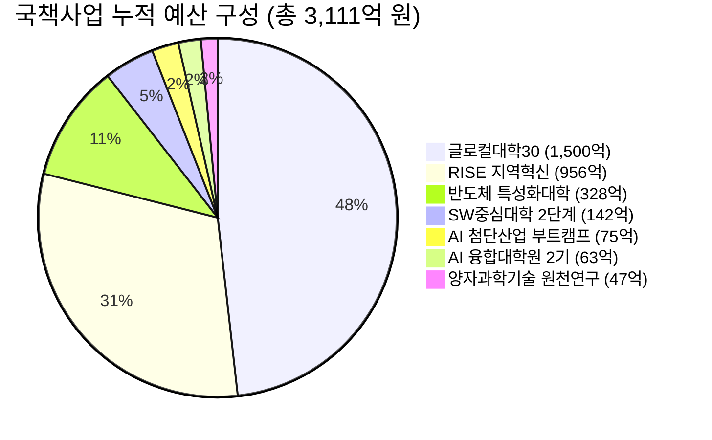
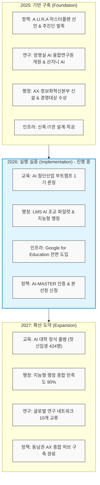

# 부산대학교 AI 거점대학육성사업단 (ARISE PNU) 사업 소개

> [!NOTE]
> 본 문서는 **부산대학교 AI 거점대학육성사업단(ARISE PNU)** 공식 소개 페이지([arise-ai.pusan.ac.kr/s30/about/](https://arise-ai.pusan.ac.kr/s30/about/))의 콘텐츠를 크롤링하여 체계적으로 정리한 보고서입니다.

---

## 1. 사업 개요 (Overview)

부산대학교는 교육부 선정 **2025 AI 거점대학**으로서, 미래 산업을 선도하고 지역 혁신을 완성하는 **AX(AI Transformation, 인공지능 전환)**의 중추적 역할을 수행합니다.

### 💡 사업 비전 및 슬로건
*   **슬로건**: *"Arise PNU, 같이 더 높게"*
*   **역할**: 동남권 AX 생태계의 중심 거점

> **최재원 부산대학교 총장 격려사**
> 
> "인공지능은 국가와 지역 경쟁력을 좌우하는 구조적 대전환의 핵심입니다. 부산대학교는 동남권 AX 생태계를 주도하겠습니다."

---

## 2. 사업 정체성 (Identity)

부산대학교 AI 거점대학육성사업단은 다음 4가지 핵심 축을 정체성으로 삼고 있습니다.

| 구분 | 타이틀 | 주요 내용 |
| :--- | :--- | :--- |
| **SELECTED** | **교육부 선정 (2025)** | 대한민국 공식 AI 거점대학 지정 |
| **REGION** | **동남권 AX 중심축** | 지역 산업 AI 융합 솔루션 공급 |
| **MILESTONE** | **개교 80주년 기념** | 미래 100년 AI 지식 생태계 구축 |
| **RANK** | **국립대 1위 (3년 연속)** | 교육·연구·산학 전 부문 정상 달성 |

---

## 3. 핵심 지표 (Key Metrics)

한눈에 보는 ARISE PNU의 정량적 지표와 미래 목표입니다.

*   **누적 국책사업 예산**: **3,111억 원** (2023년 ~ 현재 누적)
*   **핵심 교수진**: **58명** (AI 분야 핵심 전임 교수진)
*   **AI 대학 신입생 정원**: **424명** (2027년 목표)
*   **세계대학 순위**: **QS 473위**
*   **2030년 목표 (Target 2030)**: **QS Top 200** 진입 및 개교 100주년(2046년) 대비 글로벌 Top 100 진입

---

## 4. 국책사업 예산 구조 (Funding Architecture)

부산대학교는 8개 대형 국책사업을 통해 총 **3,111억 원**의 누적 예산을 확보하여 혁신을 추진하고 있습니다. *(출처: 부산대 기획처, 2026.05.26)*

### 📊 예산 상세 구성
1.  **글로컬대학30**: 1,500억 원 (48.2%)
2.  **RISE 지역혁신**: 956억 원 (30.7%)
3.  **반도체 특성화대학**: 328억 원 (10.5%)
4.  **SW중심대학 2단계**: 142억 원 (4.6%)
5.  **AI 첨단산업 부트캠프**: 75억 원 (2.4%)
6.  **AI 융합대학원 2기**: 63억 원 (2.0%)
7.  **양자과학기술 원천연구**: 47억 원 (1.5%)

---

## 5. A.U.R.A 2.0 추진 규모

체계적인 AX 추진을 위해 수립된 A.U.R.A 2.0 마스터플랜의 추진 프레임워크 규모입니다.

*   **8대 전략 목표** (Strategic Goals)
*   **22개 핵심 전략 과제** (Strategic Tasks)
*   **47개 현장 실행 과제** (Action Items)

---

## 6. 주요 성과 (Impact & Achievements)

*   **RoboCup 2025 우승**: 세계 챔피언 달성 (8/8 미션 완벽 수행)
*   **국제 경진대회 수상**: 28회 이상 (Global Awards)
*   **연간 논문 발표**: 480편 이상 (Papers)
*   **양자 AI 선도**: 47억 규모 국내 최초 양자AI 원천연구 수행
*   **기타 주요 인증 및 수상**:
    *   2025 경영대상 AI 혁신 대상 수상 (KMAC 주관, 대학 중 유일)
    *   *University AI-MASTER* 국내 대학 최초 인증
    *   기술이전 및 창업 누적 성과 **12억 원** 달성
    *   산학 및 글로벌 협력 파트너십 **35개 이상** 구축

---

## 7. 3개년 로드맵 및 비전 (Vision 2025–2027)

기반 구축 단계에서 최종 동남권 AX 종합 허브로 거듭나기 위한 단계별 이행 계획입니다.

### 🗓️ 연도별 세부 추진 내역

#### 1) 2025년: 기반 구축 (Foundation)
*   **정책**: A.U.R.A 마스터플랜 선언 및 추진단 공식 발족
*   **연구**: 장영실 AI 융합연구원 개원, 자체 AI 모델 '산지니 AI' 개발
*   **행정**: AX·정보화혁신본부 신설 및 경영대상 AI 혁신 부문 수상
*   **인프라**: AI 교육 및 연구 환경 조성을 위한 신축 IT관 설계 및 착공

#### 2) 2026년: 실행 및 실증 (Implementation) `현재 단계`
*   **교육**: AI 첨단산업 부트캠프 1기 공식 론칭
*   **행정**: LMS 내 AI 조교 파일럿 도입 및 지능형 행정 시스템 시범 운영
*   **인프라**: *Google for Education* 대학 전면 도입
*   **정책**: AI-MASTER 인증 획득 및 거점대학 본 선정 신청

#### 3) 2027년: 확산 및 도약 (Expansion)
*   **교육**: AI 대학 정식 출범 및 신입생 424명 모집
*   **행정**: 지능형 행정 종합 만족도 90% 이상 달성
*   **연구**: 글로벌 최고 수준 연구 네트워크 10개 이상과 학술 교류 활성화
*   **정책**: 동남권 전역을 아우르는 AX 종합 허브 구축 완성

---

## 8. 연락처 및 위치 정보 (Contact)

*   **📍 주소**: 부산광역시 금정구 부산대학로 63번길 2, IT관 3층 AI 거점사업단
*   **📞 전화번호**: 051-510-0000
*   **✉ 이메일**: arise@pusan.ac.kr
*   **⏰ 운영시간**: 평일 09:00 ~ 18:00 (주말 및 공휴일 휴무)
