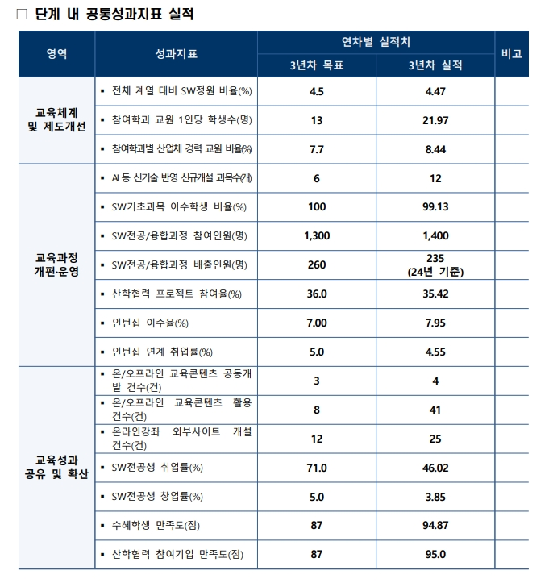

# SW중심대학 성과지표1.jpg

> 원본 이미지: SW중심대학 성과지표1.jpg

## 종류
성과지표(KPI) 표. 제목 "단계 내 공통성과지표 실적" — SW중심대학 사업의 영역별 공통성과지표에 대한 "3년차 목표"와 "3년차 실적"을 비교하는 표이다.

## 전사(글자)

### 제목
□ 단계 내 공통성과지표 실적

### 표 (열: 영역 / 성과지표 / 연차별 실적치(3년차 목표, 3년차 실적) / 비고)

| 영역 | 성과지표 | 3년차 목표 | 3년차 실적 | 비고 |
|------|----------|-----------|-----------|------|
| 교육체계 및 제도개선 | 전체 계열 대비 SW정원 비율(%) | 4.5 | 4.47 | |
| 교육체계 및 제도개선 | 참여학과 교원 1인당 학생수(명) | 13 | 21.97 | |
| 교육체계 및 제도개선 | 참여학과별 산업체 경력 교원 비율(%) | 7.7 | 8.44 | |
| 교육과정 개편·운영 | AI 등 신기술 반영 신규개설 과목수(개) | 6 | 12 | |
| 교육과정 개편·운영 | SW기초과목 이수학생 비율(%) | 100 | 99.13 | |
| 교육과정 개편·운영 | SW전공/융합과정 참여인원(명) | 1,300 | 1,400 | |
| 교육과정 개편·운영 | SW전공/융합과정 배출인원(명) | 260 | 235 (24년 기준) | |
| 교육과정 개편·운영 | 산학협력 프로젝트 참여율(%) | 36.0 | 35.42 | |
| 교육과정 개편·운영 | 인턴십 이수율(%) | 7.00 | 7.95 | |
| 교육과정 개편·운영 | 인턴십 연계 취업률(%) | 5.0 | 4.55 | |
| 교육성과 공유 및 확산 | 온/오프라인 교육콘텐츠 공동개발 건수(건) | 3 | 4 | |
| 교육성과 공유 및 확산 | 온/오프라인 교육콘텐츠 활용 건수(건) | 8 | 41 | |
| 교육성과 공유 및 확산 | 온라인강좌 외부사이트 개설 건수(건) | 12 | 25 | |
| 교육성과 공유 및 확산 | SW전공생 취업률(%) | 71.0 | 46.02 | |
| 교육성과 공유 및 확산 | SW전공생 창업률(%) | 5.0 | 3.85 | |
| 교육성과 공유 및 확산 | 수혜학생 만족도(점) | 87 | 94.87 | |
| 교육성과 공유 및 확산 | 산학협력 참여기업 만족도(점) | 87 | 95.0 | |

> 참고: "SW전공/융합과정 배출인원(명)"의 3년차 실적 235에는 "(24년 기준)" 주석이 붙어 있다. 비고란은 그 외 모두 공란이다.

## 구조 설명
- 표는 좌측에 3개 대분류 "영역"(교육체계 및 제도개선 / 교육과정 개편·운영 / 교육성과 공유 및 확산)을 세로 병합 셀로 두고, 각 영역별 성과지표를 행으로 나열한다.
- 상단 헤더는 2단 구조로, "연차별 실적치"가 상위 헤더이고 그 아래 "3년차 목표"와 "3년차 실적" 두 하위 열로 나뉜다. 맨 오른쪽은 "비고" 열.
- 영역 헤더 및 표 제목 행은 짙은 남색 배경(흰 글씨), 데이터 행은 흰색 배경에 수치가 굵게 표시된다.
- 내용상 목표 대비 실적 비교표로, 일부 지표(교원 1인당 학생수, SW전공생 취업률, 창업률 등)는 목표 대비 미달, 일부(신규개설 과목수, 콘텐츠 활용 건수, 만족도 등)는 목표 초과 달성을 보인다.
