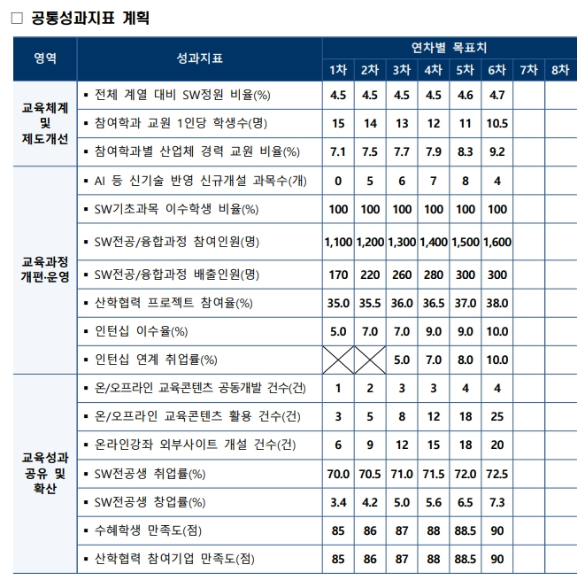

# SW중심대학 성과지표2.jpg

> 원본 이미지: SW중심대학 성과지표2.jpg

## 종류
성과지표(KPI) 계획 표. 제목 "공통성과지표 계획" — SW중심대학 사업의 영역별 공통성과지표에 대한 1차~8차 연차별 목표치를 정리한 표이다(1~6차는 값 입력, 7·8차는 공란).

## 전사(글자)

### 제목
□ 공통성과지표 계획

### 표 (열: 영역 / 성과지표 / 연차별 목표치(1차~8차))

| 영역 | 성과지표 | 1차 | 2차 | 3차 | 4차 | 5차 | 6차 | 7차 | 8차 |
|------|----------|----|----|----|----|----|----|----|----|
| 교육체계 및 제도개선 | 전체 계열 대비 SW정원 비율(%) | 4.5 | 4.5 | 4.5 | 4.5 | 4.6 | 4.7 | | |
| 교육체계 및 제도개선 | 참여학과 교원 1인당 학생수(명) | 15 | 14 | 13 | 12 | 11 | 10.5 | | |
| 교육체계 및 제도개선 | 참여학과별 산업체 경력 교원 비율(%) | 7.1 | 7.5 | 7.7 | 7.9 | 8.3 | 9.2 | | |
| 교육과정 개편·운영 | AI 등 신기술 반영 신규개설 과목수(개) | 0 | 5 | 6 | 7 | 8 | 4 | | |
| 교육과정 개편·운영 | SW기초과목 이수학생 비율(%) | 100 | 100 | 100 | 100 | 100 | 100 | | |
| 교육과정 개편·운영 | SW전공/융합과정 참여인원(명) | 1,100 | 1,200 | 1,300 | 1,400 | 1,500 | 1,600 | | |
| 교육과정 개편·운영 | SW전공/융합과정 배출인원(명) | 170 | 220 | 260 | 280 | 300 | 300 | | |
| 교육과정 개편·운영 | 산학협력 프로젝트 참여율(%) | 35.0 | 35.5 | 36.0 | 36.5 | 37.0 | 38.0 | | |
| 교육과정 개편·운영 | 인턴십 이수율(%) | 5.0 | 7.0 | 7.0 | 9.0 | 9.0 | 10.0 | | |
| 교육과정 개편·운영 | 인턴십 연계 취업률(%) | (해당없음, X 표시) | (해당없음, X 표시) | 5.0 | 7.0 | 8.0 | 10.0 | | |
| 교육성과 공유 및 확산 | 온/오프라인 교육콘텐츠 공동개발 건수(건) | 1 | 2 | 3 | 3 | 4 | 4 | | |
| 교육성과 공유 및 확산 | 온/오프라인 교육콘텐츠 활용 건수(건) | 3 | 5 | 8 | 12 | 18 | 25 | | |
| 교육성과 공유 및 확산 | 온라인강좌 외부사이트 개설 건수(건) | 6 | 9 | 12 | 15 | 18 | 20 | | |
| 교육성과 공유 및 확산 | SW전공생 취업률(%) | 70.0 | 70.5 | 71.0 | 71.5 | 72.0 | 72.5 | | |
| 교육성과 공유 및 확산 | SW전공생 창업률(%) | 3.4 | 4.2 | 5.0 | 5.6 | 6.5 | 7.3 | | |
| 교육성과 공유 및 확산 | 수혜학생 만족도(점) | 85 | 86 | 87 | 88 | 88.5 | 90 | | |
| 교육성과 공유 및 확산 | 산학협력 참여기업 만족도(점) | 85 | 86 | 87 | 88 | 88.5 | 90 | | |

> 참고: "인턴십 연계 취업률(%)"의 1차·2차 칸은 X(빗금) 표시로 비워져 있어 해당 연차에는 목표가 설정되지 않음을 의미한다. 7차·8차 열은 모든 행이 공란이다.

## 구조 설명
- 표는 좌측에 3개 대분류 "영역"(교육체계 및 제도개선 / 교육과정 개편·운영 / 교육성과 공유 및 확산)을 세로 병합 셀로 두고, 각 영역별 성과지표를 행으로 나열한다.
- 상단 헤더는 2단 구조로, "연차별 목표치"가 상위 헤더이고 그 아래 1차~8차 연차 열로 세분된다. 1~6차에는 수치가 채워져 있고 7·8차는 비어 있다.
- 영역 헤더 및 표 제목 행은 짙은 남색 배경(흰 글씨), 데이터 행은 흰색 배경. 대부분 지표가 차수가 올라갈수록 목표치가 점증(개선)하는 추세이다(예: SW정원 비율 4.5→4.7, 참여인원 1,100→1,600, 만족도 85→90 등). 일부 지표(교원 1인당 학생수)는 감소가 개선을 의미하여 15→10.5로 줄어든다.
- 이 표(성과지표2, 계획/목표)는 같은 영역·지표 체계를 사용하는 "SW중심대학 성과지표1.jpg"(실적)의 목표 근거가 되는 계획표에 해당한다.
