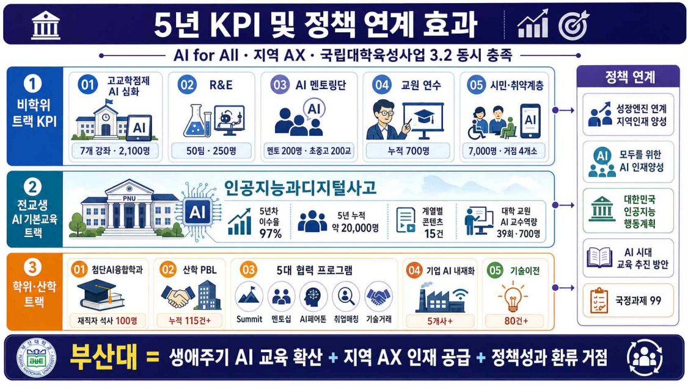

# 생애주기AI_KPI.png

> 원본 이미지: 생애주기AI_KPI.png

## 종류

KPI(핵심성과지표) 인포그래픽 + 정책 연계 효과도. 3개 트랙(비학위 / 전교생 / 학위·산학)별 세부 KPI를 아이콘과 수치로 제시하고, 우측에 정책 연계 항목, 하단에 종합 슬로건을 배치.

## 전사(글자)

### 제목 / 부제
- 5년 KPI 및 정책 연계 효과
- AI for All · 지역 AX · 국립대학육성사업 3.2 동시 충족

### ① 비학위 트랙 KPI
| 번호 | 항목 | 수치 |
|------|------|------|
| 01 | 고교학점제 AI 심화 | 7개 강좌 · 2,100명 |
| 02 | R&E | 50팀 · 250건 |
| 03 | AI 멘토링단 | 멘토 200명 · 초중고 200건 |
| 04 | 교원 연수 | 누적 700명 |
| 05 | 시민·취약계층 | 7,000명 · 거점 4개소 |

### ② 전교생 AI 기본교육 트랙
- (대표 과목) 인공지능과디지털사고
  - 5년 누적 이수율: 97%
  - 5년 누적: 약 20,000명
  - 계열별 콘텐츠: 15건
  - 대학 교원 AI 교수역량: 39회 · 700명

### ③ 학위·산학 트랙
| 번호 | 항목 | 수치 |
|------|------|------|
| 01 | 첨단AI융합학과 | 재직자 석사 100명 |
| 02 | 산학 PBL | 누적 115건+ |
| 03 | 5대 협력 프로그램 | Summit · 멘토링 · AI페어톤 · 취업박람회 · 기술거래 |
| 04 | 기업 AI 내재화 | 5개사+ |
| 05 | 기술이전 | 80건+ |

### 정책 연계 (우측, 위→아래 5개 박스)
- 성장엔진 연계 지역인재 양성
- 모두를 위한 AI 인재양성
- 대한민국 인공지능 행동계획
- AI 시대 교육 추진 방안
- 국정과제 99

### 하단 종합 슬로건
- 부산대 = 생애주기 AI 교육 확산 + 지역 AX 인재 공급 + 정책성과 환류 거점

## 구조 설명

- 좌측 본문이 세 개의 가로 트랙으로 위→아래 적층되어 있음: ① 비학위 트랙 KPI(5개 항목, 01~05 번호 카드), ② 전교생 AI 기본교육 트랙(대표 과목 "인공지능과디지털사고" 중심으로 이수율·인원·콘텐츠·교원역량 지표), ③ 학위·산학 트랙(5개 항목, 01~05 번호 카드).
- 각 항목은 아이콘 + 번호 + 항목명 + 정량 수치 형태의 카드로 표현.
- 우측에는 "정책 연계" 세로 박스가 별도로 있어, 세 트랙의 성과가 상위 정책(지역인재 양성, 모두를 위한 AI 인재양성, 대한민국 인공지능 행동계획)에 연계됨을 화살표로 연결.
- 맨 아래 가로 띠에 종합 슬로건("부산대 = 생애주기 AI 교육 확산 + 지역 AX 인재 공급 + 정책성과 환류 거점")을 배치하여 전체 KPI 체계가 지향하는 결론을 제시.

> 참고: 우측 "정책 연계" 박스는 위에서부터 5개(성장엔진 연계 지역인재 양성 / 모두를 위한 AI 인재양성 / 대한민국 인공지능 행동계획 / AI 시대 교육 추진 방안 / 국정과제 99)이며, 모두 판독 확인됨.
