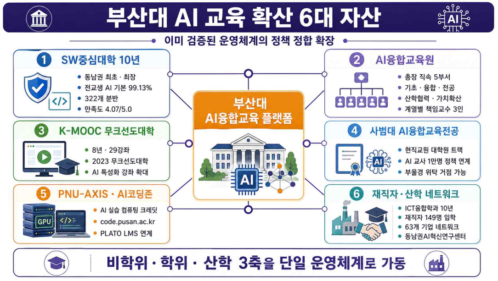

# 생애주기AI부산대자산.png

> 원본 이미지: 생애주기AI부산대자산.png

## 종류

"부산대 AI 교육 확산 6대 자산" 인포그래픽 — 중앙의 "부산대 AI융합교육 플랫폼"을 중심으로 6개 자산 카드가 둘러싼 방사형/허브-스포크 구성도. 각 자산 카드는 번호 + 아이콘 + 제목 + 세부 불릿으로 구성.

## 전사(글자)

### 제목 / 부제
- 부산대 AI 교육 확산 6대 자산
- 이미 검증된 운영체계의 정책 정합 확장

### 중앙 허브
- 부산대 AI융합교육 플랫폼

### 6대 자산 (번호순)

**① SW중심대학 10년**
- 동남권 최초 · 최장
- 전교생 AI 기본 99.13%
- 322개 분반
- 만족도 4.07/5.0

**② AI융합교육원**
- 총장 직속 5부서
- 기초 · 융합 · 전공
- 산학협력 · 가치확산
- 계열별 책임교수 3인

**③ K-MOOC 무크선도대학**
- 8년 · 29강좌
- 2023 무크선도대학
- AI 특성화 강좌 확대

**④ 사범대 AI융합교육전공**
- 현직교원 대학원 트랙
- AI 교사 1만명 정책 연계
- 부울경 위탁 거점 가능

**⑤ PNU-AXIS · AI코딩존**
- AI 실습 컴퓨팅 크레딧
- code.pusan.ac.kr
- PLATO LMS 연계

**⑥ 재직자 · 산학 네트워크**
- ICT융합학과 10년
- 재직자 149명 입학
- 63개 기업 네트워크
- 동남권AI혁신연구센터

### 하단 종합 띠
- 비학위 · 학위 · 산학 3축을 단일 운영체계로 가동

## 구조 설명

- 중앙에 "부산대 AI융합교육 플랫폼"(허브) 박스가 위치하고, 그 주위를 6개의 자산 카드가 좌·우 각각 3개씩(좌측 ①③⑤, 우측 ②④⑥) 둘러싸는 허브-스포크형 레이아웃.
- 각 카드는 좌측에 원형 번호(①~⑥)와 분야 아이콘, 상단에 자산 제목, 하단에 3~4개의 정량/정성 세부 불릿을 담고 있으며, 모든 카드가 중앙 플랫폼과 점선/곡선으로 연결되어 6대 자산이 단일 플랫폼으로 수렴함을 표현.
- 상단에 제목과 부제("이미 검증된 운영체계의 정책 정합 확장")가, 하단에 종합 띠("비학위·학위·산학 3축을 단일 운영체계로 가동")가 배치되어, 6대 자산이 3개 축(비학위/학위/산학)으로 묶여 하나의 운영체계로 작동한다는 결론을 제시.

> 참고: ⑤ PNU-AXIS·AI코딩존 카드의 첫 불릿은 "AI 실습 컴퓨팅 크레딧"으로 판독 확인됨.
