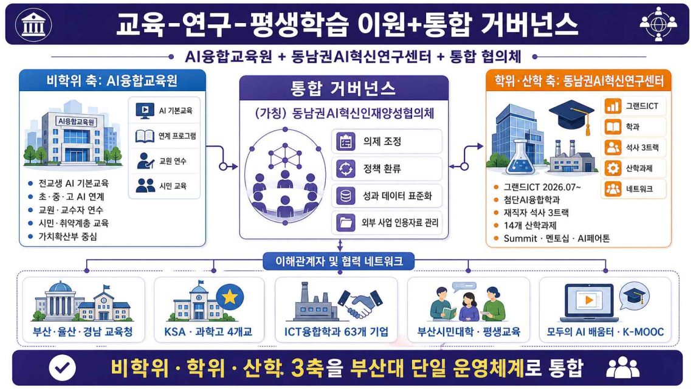

# 생애주기AI이원통합거버넌스.png

> 원본 이미지: 생애주기AI이원통합거버넌스.png

## 종류

거버넌스(운영체계) 구성도 — "교육-연구-평생학습 이원+통합 거버넌스". 좌측 비학위 축(AI융합교육원)과 우측 학위·산학 축(동남권AI혁신연구센터)이 중앙의 통합 거버넌스 협의체로 수렴하고, 하단에 이해관계자·협력 네트워크가 받치는 구조의 조직/거버넌스 차트.

## 전사(글자)

### 제목 / 부제
- 교육 · 연구 · 평생학습 이원+통합 거버넌스
- AI융합교육원 + 동남권AI혁신연구센터 + 통합 협의체

### 좌측 — 비학위 축 : AI융합교육원
- (중심 박스) AI융합교육원
- 우측 연계 항목: AI 기본교육 / 연계 프로그램 / 교원 연수 / 시민 교육
- 세부 불릿:
  - 전교생 AI 기본교육
  - 초 · 중 · 고 AI 연계
  - 교원 · 교수자 연수
  - 시민 · 취약계층 교육
  - 가치확산 중심

### 중앙 — 통합 거버넌스
- 통합 거버넌스
- (가칭) 동남권AI혁신인재양성협의체
- 기능 항목:
  - 의제 조정
  - 정책 환류
  - 성과 데이터 표준화
  - 외부 사업 인용자료 관리

### 우측 — 학위·산학 축 : 동남권AI혁신연구센터
- (중심 박스) 동남권AI혁신연구센터
- 우측 연계 항목: 그랜드ICT / 학과 / 석사 3트랙 / 산학과제 / 네트워크
- 세부 불릿:
  - 그랜드ICT 2026.07~
  - 첨단AI융합학과
  - 재직자 석사 3트랙
  - 14개 산학과제
  - Summit · 멘토십 · AI페어톤

### 하단 — 이해관계자 및 협력 네트워크
- 이해관계자 및 협력 네트워크
- 부산 · 울산 · 경남 교육청
- KSA · 과학고 4개교
- ICT융합학과 및 63개 기업
- 부산시AI센터 · 평생교육
- 모두의 AI 배움터 · K-MOOC

### 하단 종합 띠
- 비학위 · 학위 · 산학 3축을 부산대 단일 운영체계로 통합

## 구조 설명

- 상단에 제목("교육·연구·평생학습 이원+통합 거버넌스")과 부제(세 구성요소 명시)가 위치.
- 본문은 좌·중·우 3개 열로 구성된 이원+통합 구조:
  - **좌측 비학위 축**: "AI융합교육원" 중심 박스 + 비학위 교육 관련 세부 항목/불릿.
  - **우측 학위·산학 축**: "동남권AI혁신연구센터" 중심 박스 + 학위·산학 관련 세부 항목/불릿.
  - **중앙 통합 거버넌스**: 좌·우 두 축을 양방향 화살표로 잇는 "(가칭) 동남권AI혁신인재양성협의체"가 의제 조정·정책 환류·성과 데이터 표준화·외부 사업 인용자료 관리 기능을 수행하며 두 축을 통합.
- 중앙 협의체 아래에는 "이해관계자 및 협력 네트워크" 가로 띠가 있어, 교육청·과학고·기업·평생교육·K-MOOC 등 외부 협력 주체들이 거버넌스를 떠받침.
- 맨 아래 종합 띠("비학위·학위·산학 3축을 부산대 단일 운영체계로 통합")로 이원 운영을 단일 체계로 통합한다는 결론을 제시.
