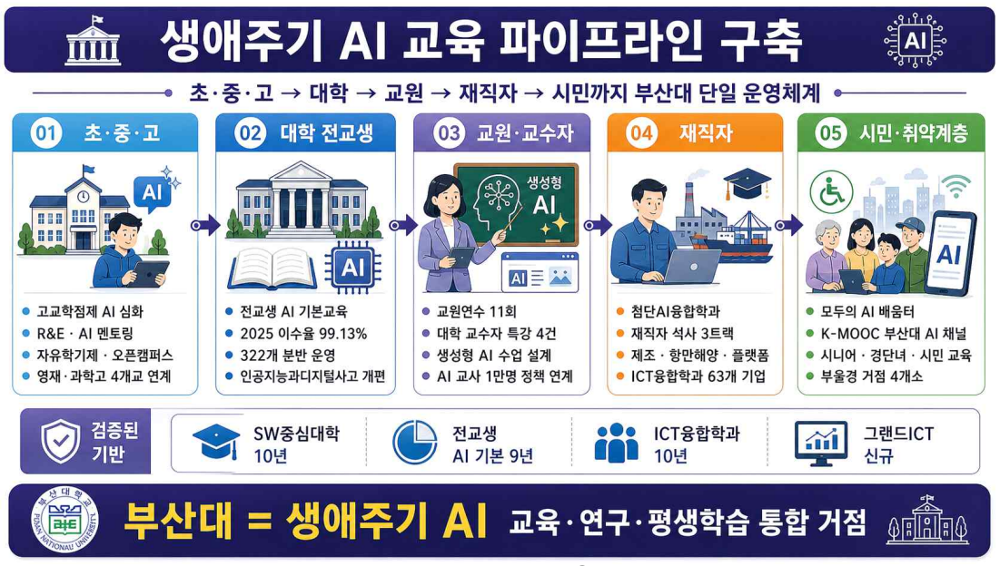

# 생애주기AI파이프라인.png

> 원본 이미지: 생애주기AI파이프라인.png

## 종류

"생애주기 AI 교육 파이프라인 구축" 파이프라인(흐름) 다이어그램 — 대상별 5단계(초·중·고 → 대학 → 교원 → 재직자 → 시민)를 좌→우 화살표로 연결한 단계도. 각 단계마다 대상 카드 + 세부 불릿 + 하단 정책 연계 태그를 배치.

## 전사(글자)

### 제목
- 생애주기 AI 교육 파이프라인 구축

### 상단 흐름 라벨
- 초·중·고 → 대학 → 교원 → 재직자 → 시민까지 부산대 단일 운영체계

### 5단계 (좌 → 우)

| 단계 | 대상 | 세부 내용(불릿) |
|------|------|----------------|
| 01 | 초·중·고 | 고교학점제 AI 심화 / R&E · AI 멘토링 / 자유학기제 · 오픈캠퍼스 / 영재 · 과학고 4개교 연계 |
| 02 | 대학 전교생 | 전교생 AI 기본교육 / 2025 이수율 99.13% / 322개 분반 운영 / 인공지능과디지털사고.kr 개편 |
| 03 | 교원·교수자 | 교원연수 11회 / 대학 교수자 특강 4건 / 생성형 AI 수업 설계 / AI 교사 1만명 정책 연계 |
| 04 | 재직자 | 첨단AI융합학과 / 재직자 석사 3트랙 / 제조 · 항만해양 · 플랫폼 / ICT융합학과 63개 기업 |
| 05 | 시민·취약계층 | 모두의 AI 배움터 / K-MOOC 부산대 AI 채널 / 시니어 · 경단녀 · 시민 교육 / 부울경 거점 4개소 |

### 하단 정책 연계 태그 (단계별)
- 검증된 기반
- SW중심대학 10년
- 전교생 AI 기본 9년
- ICT융합학과 10년
- 그랜드ICT 신규

### 하단 종합 띠
- 부산대 = 생애주기 AI 교육·연구·평생학습 통합 거점

## 구조 설명

- 상단에 제목과 흐름 라벨("초·중·고 → 대학 → 교원 → 재직자 → 시민까지 부산대 단일 운영체계")이 위치.
- 본문은 5개의 대상 단계(01~05)가 좌에서 우로 화살표로 이어지는 파이프라인 형태. 각 단계는 상단에 번호·대상명·아이콘 카드, 그 아래 4개 내외의 세부 활동 불릿으로 구성.
- 각 단계 하단에는 해당 단계를 뒷받침하는 "검증된 기반/실적" 태그(SW중심대학 10년, 전교생 AI 기본 9년, ICT융합학과 10년, 그랜드ICT 신규 등)가 아이콘과 함께 붙어, 기존 자산이 어느 단계를 지지하는지를 표현.
- 맨 아래 가로 띠에 종합 메시지("부산대 = 생애주기 AI 교육·연구·평생학습 통합 거점")를 배치하여, 전 생애주기를 단일 운영체계로 잇는 파이프라인의 결론을 제시.
