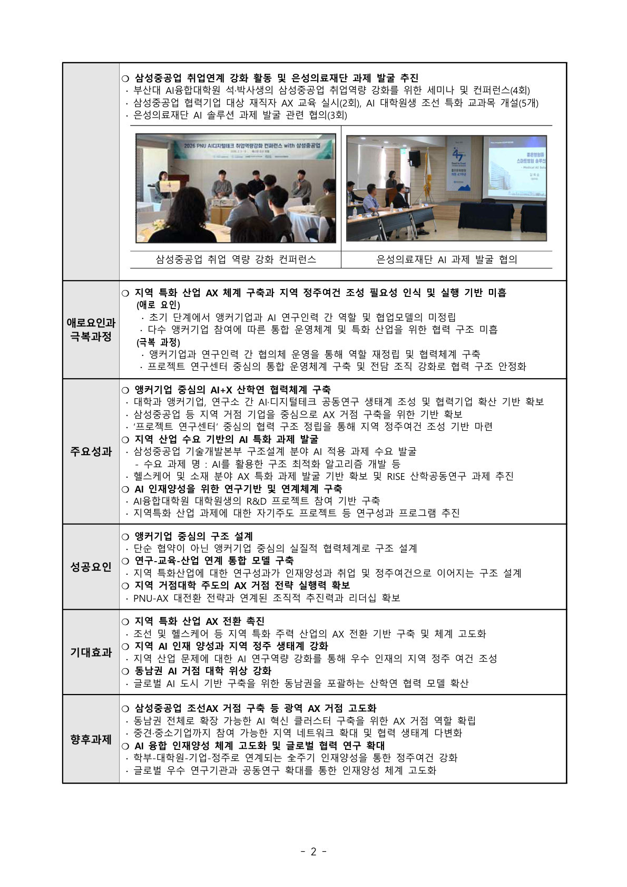

# 장영실연구원_p02.png

> 원본 이미지: 장영실연구원_p02.png

## 종류
스캔/캡처된 보고서 문서 페이지(인쇄물, 2페이지). 좌측에 회색 항목 라벨 칼럼, 우측에 본문 내용 칼럼을 둔 표 형식의 성과보고서이다. 상단에 사진 2장이 삽입된 활동 결과 섹션이 있고, 이어서 「애로요인과 극복과정」, 「주요성과」, 「성공요인」, 「기대효과」, 「향후과제」행으로 구성된다. 하단 중앙에 페이지 번호 "- 2 -".

## 전사(글자)

### (상단 섹션) 삼성중공업 취업연계 강화 활동 및 은성의료재단 과제 발굴 추진
- **○ 삼성중공업 취업연계 강화 활동 및 은성의료재단 과제 발굴 추진**
  - 부산대 AI융합대학원 석·박사생의 삼성중공업 취업역량 강화를 위한 세미나 및 컨퍼런스(4회)
  - 삼성중공업 협력기업 대상 재직자 AX 교육 실시(2회), AI 대학원생 조선 특화 교과목 개설(5개)
  - 은성의료재단 AI 솔루션 과제 발굴 관련 협의(3회)
- (사진 캡션 좌) 삼성중공업 취업 역량 강화 컨퍼런스
- (사진 캡션 우) 은성의료재단 AI 과제 발굴 협의

### (행) 애로요인과 극복과정
- **지역 특화 산업 AX 체계 구축과 지역 정주여건 조성 필요성 인식 및 실행 기반 미흡**
- **(애로 요인)**
  - 초기 단계에서 앵커기업과 AI 연구인력 간 역할 및 협업모델의 미정립
  - 다수 앵커기업 참여에 따른 통합 운영체계 및 특화 산업을 위한 협력 구조 미흡
- **(극복 과정)**
  - 앵커기업과 연구인력 간 협의체 운영을 통해 역할 재정립 및 협력체계 구축
  - 프로젝트 연구센터 중심의 통합 운영체계 구축 및 전담 조직 강화로 협력 구조 안정화

### (행) 주요성과
- **○ 앵커기업 중심의 AI+X 산학연 협력체계 구축**
  - 대학과 앵커기업, 연구소 간 AI·디지털테크 공동연구 생태계 조성 및 협력기업 확산 기반 확보
  - 삼성중공업 등 지역 거점 기업을 중심으로 AX 거점 구축을 위한 기반 확보
  - '프로젝트 연구센터' 중심의 협력 구조 정립을 통해 지역 정주여건 조성 기반 마련
- **○ 지역 산업 수요 기반의 AI 특화 과제 발굴**
  - 삼성중공업 기술개발본부 구조설계 분야 AI 적용 과제 수요 발굴
    - 수요 과제 예 : AI를 활용한 구조 최적화 알고리즘 개발 등
  - 헬스케어 AI 소재 분야 AX 특화 과제 발굴 기반 확보 및 RISE 산학공동연구 과제 추진
- **○ AI 인재양성을 위한 연구기반 및 연계체계 구축**
  - AI융합대학원 대학원생의 R&D 프로젝트 참여 기반 구축
  - 지역특화 산업 과제에 대한 자기주도 프로젝트 등 연구성과 및 프로그램 추진

### (행) 성공요인
- **○ 앵커기업 중심의 구조 설계**
  - 단순 협약이 아닌 앵커기업 중심의 실질적 협력체계로 구조 설계
- **○ 연구-교육-산업 연계 통합 모델 구축**
  - 지역 특화산업에 대한 연구성과가 인재양성 및 취업 및 정주여건으로 이어지는 구조 설계
  - 지역 거점대학 주도의 AX 거점 전략 실행력 확보
  - PNU-AX 대전환 전략과 연계된 조직적 추진력 및 리더십 확보

### (행) 기대효과
- **○ 지역 특화 산업 AX 전환 촉진**
  - 조선 및 헬스케어 등 지역 주력 산업의 AX 전환 기반 구축 및 체계 고도화
- **○ 지역 AI 인재 양성과 지역 정주 생태계 강화**
  - 지역 산업 문제에 대한 AI 연구역량 확대 및 우수 인재의 지역 정주 여건 조성
- **○ 동남권 AI 거점 대학 위상 강화**
  - 글로벌 AI 도시 기반 영남권을 포괄하는 산학연 협력 모델 확보

### (행) 향후과제
- **○ 삼성중공업·조선AX 거점 등 광역 AX 거점 고도화**
  - 동남권 전체로 확장 가능한 AI 혁신 클러스터 구축을 위한 AX 거점 역할 확립
  - 부산권을 중심으로 동남권 지역 내 AI 네트워크 협력체계 구축 및 권역 생태계 다변화
- **○ AI 인재양성 체계 고도화 및 글로벌 협력 연구 확대**
  - 학부-대학원-기업-정주로 연계되는 全주기 인재양성을 통한 정주여건 강화
  - 글로벌 우수 연구기관과 공동연구 확대를 통한 인재양성 체계 고도화

### 하단
- 페이지 번호 : - 2 -

## 구조 설명
- 좌-우 2단 표 형식이다. 좌측에 회색 배경의 항목 라벨(애로요인과 극복과정, 주요성과, 성공요인, 기대효과, 향후과제)이 세로로 배치되고, 각 라벨에 대응하는 본문이 우측 넓은 칼럼에 글머리표(○ 대제목, · 세부 항목)로 정리된다.
- 페이지 최상단은 별도 라벨 없이 활동 결과 섹션("삼성중공업 취업연계 강화 활동 및 은성의료재단 과제 발굴 추진")이며, 본문 글머리표 아래에 사진 2장(좌: 삼성중공업 취업 역량 강화 컨퍼런스, 우: 은성의료재단 AI 과제 발굴 협의)이 캡션과 함께 삽입되어 있다.
- 이후 「애로요인과 극복과정」은 애로 요인/극복 과정 소그룹으로, 나머지 행은 ○ 단위 대제목과 · 단위 세부 항목으로 위계가 나뉜다.
- 페이지 하단 중앙에 "- 2 -" 쪽 번호가 있어 다중 페이지 보고서의 2면임을 나타낸다.
- 전반적으로 인쇄 품질은 양호하며 손글씨 주석은 없다. 표 셀 경계는 얇은 검은 선이다.
