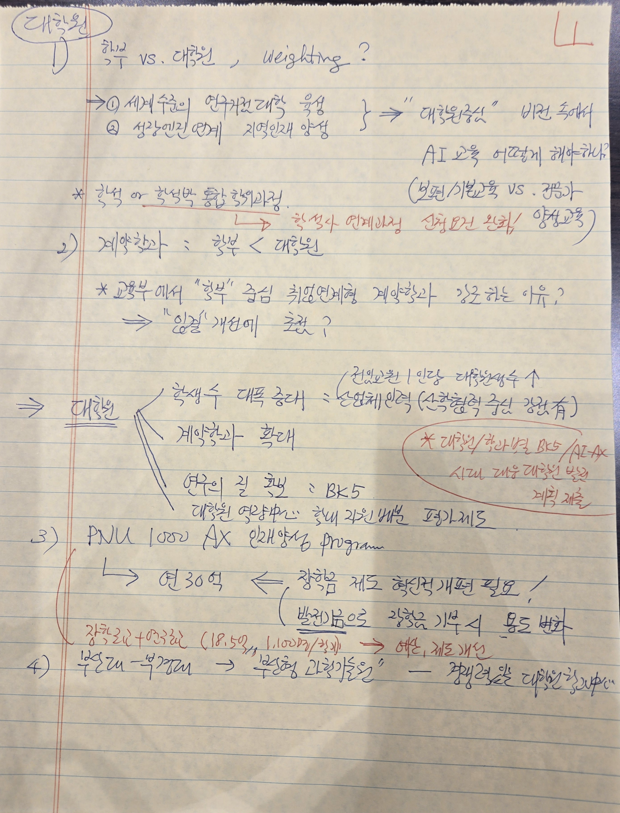

# 제안발표0507_총장님_Feedback_1of3.jpg

> 원본 이미지: 제안발표0507_총장님_Feedback_1of3.jpg

## 종류
촬영된 손글씨 메모 사진(3매 중 1매). 줄이 인쇄된 노트(괘선 노트) 위에 총장님이 2025-05-07 제안발표를 보고 펜으로 작성한 피드백 메모이다. 인쇄된 텍스트는 없고(괘선·여백선만 인쇄), 본문은 모두 손글씨(파랑/검정 본문, 빨강·초록 강조)이다. 좌측 상단에 원으로 감싼 머리 제목 「대학원」, 우측 상단에 페이지 표시 「1」(빨강).

## 전사(글자)

> 표기 규칙: 모든 내용은 손글씨이므로 아래는 모두 [손글씨 메모]. 펜 색상은 (파/검=본문, 빨강=강조·삽입, 초록=일부 강조)로 구분 표기. 한자·영문은 원문대로.

### 머리/페이지 표시
- (좌상단, 원 안) **대학원**
- (우상단, 빨강) **1** (페이지 번호)

### 1) 학부 vs. 대학원, weighting?
- **1) 학부 vs. 대학원 , weighting ?**
  - → ① 세계 수준의 연구중심대학 육성
  - → ② 성장엔진 연계 지역인재 양성
  - (위 ①②를 묶어 우측 화살표) ⇒ **"대학원중심"** 비전 속에서 / AI 교육 어떻게 해야하나
  - (우측 괄호 보충, 파랑) (보편/기본교육 vs. 평가(?))
  - ✱ 학석(學碩) or 학석박 통합 학위과정
    - → (빨강 삽입) 학석사 연계과정 / 선행(?)인정 / 양성(?)교육 [추정: "학·석사 연계과정 선행인정 / 양성교육"]

### 2) 계약학과 : 학부 < 대학원
- **2) 계약학과 : 학부 < 대학원**
  - ✱ 교육부에서 "학부" 중심 취업연계형 계약학과 강요하는 이유?
  - ⇒ "일자리" 개선에 초점 ?
- (좌측 큰 화살표) ⇒ **대학원**  ← (가지로 묶이는 3개 항목)
  - 학생수 대폭 증대 ＝ 산학체 인력(?) (선착협력(?) 중심 강화 有)
    - (우측 보충, 파랑) (전임교원 / 인당 대학원생수 ↑)
  - 계약학과 확대
  - 연구의 질 향상(?) ＝ BK5
    - 대학원 영향(?)중심 학내 자원배분 평가제도

#### (우측, 빨강 원으로 강조한 삽입 메모)
> ✱ **대학원/학과별 BK5 / AI-AX 시대 대응 대학원 발전 계획 제출**
> [추정: "대학원/학과별 BK5 / AI-AX 시대 대응 대학원 발전계획 제출"]

### 3) PNU 1000 AX 인재양성 program
- **3) PNU 1000 AX 인재양성 program**
  - → **연 30억** ← (빨강) 장학금 제도 혁신적 개편 필요!
    - (괄호 안, 빨강) (발전기금으로 장학금 기부 ← 동문 발전(?))
  - (빨강) 장학금 + 연구비 (18.5억, 1,000명/2년) → 예산, 제도 개선
  > [추정: "장학금 + 연구비 (18.5억 / 1,000명 / 2년)"]

### 4) 부산대-부경대 → 부산형 과학기술원
- **4) 부산대-부경대 → "부산형 과학기술원"** — 광역경제 살릴 대학연합방안(?)
  > [추정: 끝부분 "광역경제 살릴 대학연합방안" — 글자가 작고 흘림이라 일부 불확실]

## 구조 설명
- 괘선 노트 한 장에 번호 매긴 항목 1)~4)를 위에서 아래로 손글씨로 정리한 형태이다. 좌측에 빨간 세로 여백선(노트 기본 인쇄선)이 있고, 그 오른쪽 본문 영역에 메모가 채워진다.
- 좌상단에 원으로 감싼 「대학원」이 이 페이지의 대주제임을 표시하고, 우상단에 빨강 「1」로 페이지를 매겼다.
- 1) 항목은 "학부 vs 대학원 weighting"이라는 질문을 던지고, 화살표(→/⇒)로 두 육성 방향(①세계 수준 연구중심대학, ②성장엔진 연계 지역인재)을 "대학원중심" 비전으로 묶는다. 별표(✱)로 학·석·박 통합 학위과정 아이디어를 덧붙인다.
- 2) 항목은 계약학과를 학부<대학원으로 무게를 두자는 취지로, 좌측에서 큰 화살표가 "대학원"을 가리키고 거기서 3개 가지(학생수 증대, 계약학과 확대, 연구의 질 향상=BK5)가 뻗는다. 우측에는 빨간 펜으로 타원을 그려 "대학원/학과별 BK5 / AI-AX 시대 대응 대학원 발전계획 제출"이라는 지시를 강조 삽입한다.
- 3) 항목은 PNU 1000 AX 인재양성 프로그램의 예산(연 30억, 장학금+연구비 18.5억/1,000명/2년)과 장학금 제도 개편·발전기금 기부 연계를 빨간 펜 보충으로 적었다.
- 4) 항목은 부산대-부경대 통합을 통한 "부산형 과학기술원" 구상으로 페이지를 마무리한다.
- 색상: 본문은 파랑/검정, 강조·삽입·지시는 빨강(우측 타원, 3)의 예산 메모), 일부 보충은 초록 계열로 위계를 구분한다.
