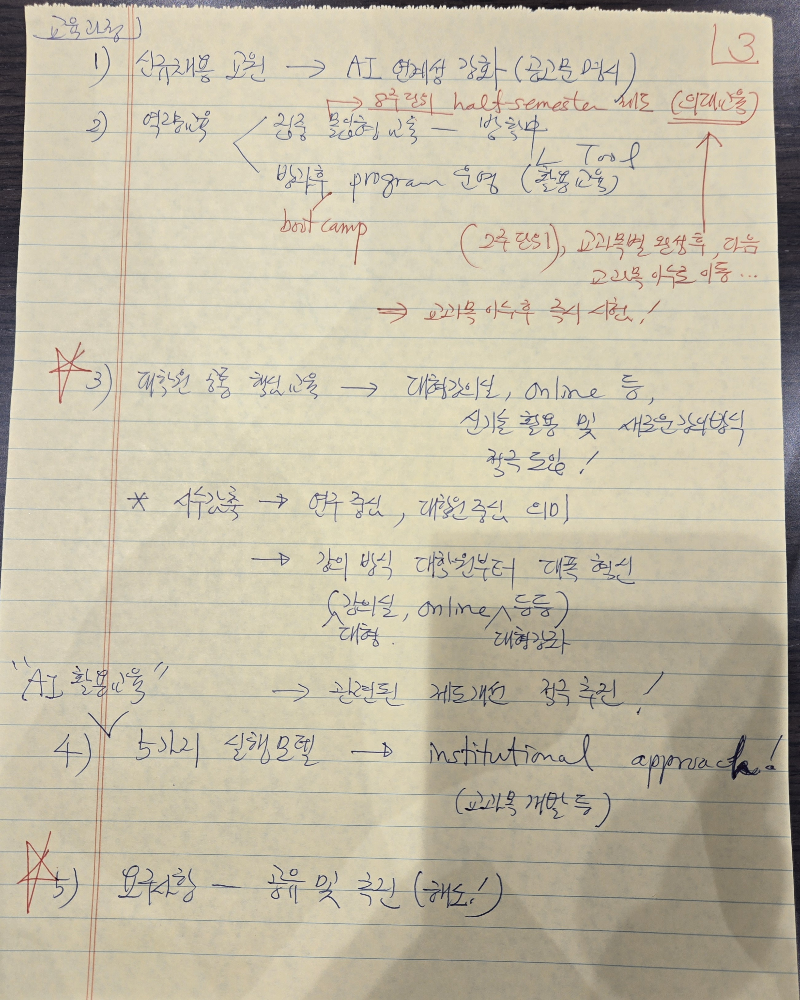

# 제안발표0507_총장님_Feedback_3of3.jpg

> 원본 이미지: 제안발표0507_총장님_Feedback_3of3.jpg

## 종류
촬영된 손글씨 메모 사진(3매 중 3매, 마지막 장). 괘선 노트 위에 총장님이 작성한 피드백 메모이다. 인쇄 텍스트는 없고(괘선만 인쇄), 본문은 모두 손글씨(파랑/검정 본문, 빨강·초록 강조). 좌상단에 머리 제목 「교육과정」, 우측 상단에 페이지 표시 「3」(빨강).

## 전사(글자)

> 표기 규칙: 모든 내용은 [손글씨 메모]. 펜 색상은 (파/검=본문, 빨강=강조·삽입, 초록=보충)로 표기. 영문은 원문대로.

### 머리/페이지 표시
- (좌상단) **교육과정)**
- (우상단, 빨강) **3**

### 1) 신규채용 교원 → AI 연계성 강화
- **1) 신규채용 교원 → AI 연계성 강화** (괄호) (공고문 명시)

### 2) 역량배양
- **2) 역량배양** ← (가지로 분기)
  - 집중 몰입형 교육(?) — (빨강) 8주제(?) half-semester 제도 (우측 빨강, 밑줄) (의대(?)식)
  - 방학중 program 운영 (괄호) (집중교육)
    - (빨강) boot camp
    - (우측 화살표) ↳ Tool / (집중 교육)
  - (우측 빨강 보충) (2주 단위), 교과목별 완성후, 다음 교과목 이수로 이동…
    - (빨강) ⇒ 교과목 이수후 즉시 사회진출(?)/대학원진학(?)!
  > [추정: "8주제 half-semester 제도(의대식)", "교과목 이수후 즉시 ~" 끝부분 일부 불확실]

### 3) 대학원 등 학위과정 (좌측 빨강 별표 ✱)
- **3) 대학원 등 학위과정** → 대학자율형(?), online 등,
  - 신기술 활용 및 새로운 교육방식 적극 도입!
- ✱ (빨강) 산학(?)측 → 연구 중심, 대학원 중심 의미
  - → 강의 방식 대전환부터 대폭 혁신
  - (괄호) (강의실, online 등등)
    - (아래 보충) 대형 / 대형강좌
  > [추정: "산학측", "대학자율형", 괄호 내 보충은 흘림으로 일부 불확실]

### (구분 강조) "AI 활용도(?)"
- **"AI 활용도(?)"** → 관련된 제도개선 적극 추진!
  > [추정: 따옴표 안 단어는 "AI 활용도" 또는 "AI 활용능력"으로 보임]

### 4) 5가지 실행모델 → institutional approach!
- **4) 5가지 실행모델 → institutional approach!**
  - (괄호) (교과목 개발 등)

### 5) 요구사항 — 공유 및 추진 (좌측 빨강 ✱)
- ✱ **5) 요구사항 — 공유 및 추진** (괄호) (제도!)

## 구조 설명
- 괘선 노트 마지막 장에 번호 항목 1)~5)를 위에서 아래로 손글씨로 정리했다. 좌측 빨간 세로 여백선이 있고, 좌상단 머리 제목 「교육과정」이 이 페이지의 대주제, 우상단 빨강 「3」이 페이지 번호이다.
- 1) 신규채용 교원의 AI 연계성 강화(공고문 명시)를 한 줄로 적었다.
- 2) 역량배양은 좌측에서 가지로 분기하여 "집중 몰입형 교육"과 "방학중 program 운영(집중교육)"으로 나뉘고, 빨간 펜으로 8주제 half-semester 제도(의대식), boot camp, Tool, 2주 단위 교과목별 완성 후 다음 교과목 이수로 이동, 교과목 이수 후 즉시 사회진출/대학원진학 등을 보충·강조한다.
- 3) 대학원 등 학위과정은 대학자율형·online 등 신기술 활용·새로운 교육방식 적극 도입을 주장하고, 빨간 별표로 "연구 중심·대학원 중심" 의미, 강의 방식 대전환(강의실·online·대형강좌)까지 대폭 혁신을 강조한다.
- 그 아래 따옴표로 "AI 활용도"를 구분 강조하며 관련 제도개선 적극 추진을 적는다.
- 4) 5가지 실행모델을 "institutional approach!"(교과목 개발 등)로 묶고, 5) 요구사항은 공유 및 추진(제도!)으로 마무리한다. 3)과 5) 항목 좌측에는 빨간 별표(✱)로 강조 표시가 붙어 있다.
- 색상: 본문 파랑/검정, 강조·삽입·지시는 빨강으로 위계를 구분한다.
