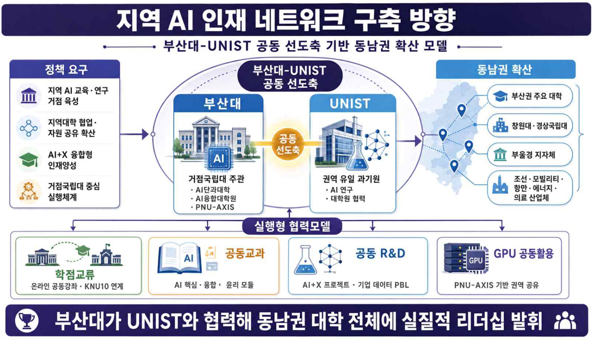

# 지역AI인재네트워크구축방향.png

> 원본 이미지: 지역AI인재네트워크구축방향.png

## 종류
인포그래픽형 개념도(다이어그램). 부산대-UNIST 공동 선도축을 기반으로 한 "지역 AI 인재 네트워크 구축 방향"을 나타낸다. 상단 제목 띠, 좌측 「정책 요구」열, 중앙 「부산대-UNIST 공동 선도축」허브, 우측 「동남권 확산」열, 중하단 「실행형 협력모델」4개 블록, 최하단 결론 띠로 구성된다.

## 전사(글자)

### 상단 제목
- (제목) **지역 AI 인재 네트워크 구축 방향**
- (부제) 부산대-UNIST 공동 선도축 기반 동남권 확산 모델

### 좌측 「정책 요구」
| 아이콘 | 항목 |
|--------|------|
| 건물 | 지역 AI 교육·연구 거점 육성 |
| 노드/연결 | 지역대학 협업·자원 공유 확산 |
| 학사모 | AI+X 융합형 인재양성 |
| 로봇 | 거점국립대 중심 실행체계 |

### 중앙 「부산대-UNIST 공동 선도축」
- (허브 라벨) **부산대-UNIST 공동 선도축**
- **부산대**
  - 거점국립대 주관
  - AI단과대학
  - AI융합대학원
  - PNU-AXIS
- (중앙 연결 라벨) **공동 선도축**
- **UNIST**
  - 권역 유일 과기원
  - AI 연구
  - 대학원 협력

### 우측 「동남권 확산」 (지도 위 위치핀과 연결)
| 아이콘 | 항목 |
|--------|------|
| 학사모/건물 | 부산권 주요 대학 |
| 건물 | 창원대·경상국립대 |
| 기관 | 부울경 지자체 |
| 산업체 | 조선·모빌리티·항만·에너지·의료 산업체 |

### 중하단 「실행형 협력모델」 (4개 블록)
| 블록 | 제목 | 설명 |
|------|------|------|
| 1 | 학점교류 | 온라인 공동강좌·KNU10 연계 |
| 2 | 공동교과 | AI 핵심·융합·윤리 모듈 |
| 3 | 공동 R&D | AI+X 프로젝트·기업 데이터 PBL |
| 4 | GPU 공동활용 | PNU-AXIS 기반 권역 공유 |

### 최하단 결론 띠
- **부산대가 UNIST와 협력해 동남권 대학 전체에 실질적 리더십 발휘**

## 구조 설명
- 최상단에 진한 남색 제목 띠가 있고 그 아래 부제가 놓인다.
- 좌측 「정책 요구」열은 4개 항목을 아이콘과 함께 세로로 나열하며, 우측 중앙 허브를 향해 화살표로 연결된다.
- 중앙은 타원형 허브로, 좌측 「부산대」박스와 우측 「UNIST」박스를 중앙의 오렌지색 「공동 선도축」노드가 잇는다. 부산대는 거점국립대 주관(AI단과대학·AI융합대학원·PNU-AXIS), UNIST는 권역 유일 과기원(AI 연구·대학원 협력)으로 역할이 구분된다. 허브 상단에 「부산대-UNIST 공동 선도축」라벨이 붙는다.
- 우측 「동남권 확산」열은 동남권 지도 그래픽 위에 위치핀을 찍고, 부산권 주요 대학·창원대·경상국립대·부울경 지자체·산업체(조선·모빌리티·항만·에너지·의료)로 확산되는 모습을 점선으로 연결한다.
- 중앙 허브에서 아래로 「실행형 협력모델」 4개 블록(학점교류·공동교과·공동 R&D·GPU 공동활용)이 화살표로 이어진다.
- 최하단에 진한 남색 결론 띠가 전체 메시지("부산대가 UNIST와 협력해 동남권 대학 전체에 실질적 리더십 발휘")를 요약한다.
