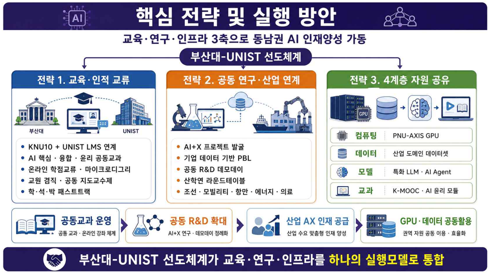

# 지역AI인재네트워크실행방안.png

> 원본 이미지: 지역AI인재네트워크실행방안.png

## 종류
인포그래픽형 전략도(다이어그램). "핵심 전략 및 실행 방안"을 교육·연구·인프라 3축으로 동남권 AI 인재양성을 가동한다는 내용으로, 3개 전략 칼럼과 그 아래 4개 실행 블록, 최하단 결론 띠로 구성된다.

## 전사(글자)

### 상단 제목
- (제목) **핵심 전략 및 실행 방안**
- (부제) 교육·연구·인프라 3축으로 동남권 AI 인재양성 가동
- (강조 라벨) **부산대-UNIST 선도체계**

### 전략 칼럼 (3개)

#### 전략 1. 교육·인적 교류  (부산대 ↔ UNIST)
- KNU10 + UNIST LMS 연계
- AI 핵심·융합·윤리 공동교과
- 온라인 학점교류·마이크로디그리
- 교원 겸직·공동 지도교수제
- 학·석·박 패스트트랙

#### 전략 2. 공동 연구·산업 연계
- AI+X 프로젝트 발굴
- 기업 데이터 기반 PBL
- 공동 R&D 대모델어(*)
- 산학연 라운드테이블
- 조선·모빌리티·항만·에너지·의료

> (*) 「공동 R&D 대모델어」행은 인쇄가 작아 일부 글자가 불확실하다. [추정: "공동 R&D 대형 모델 연계" 또는 "공동 R&D 대모델어(語)"] [판독 불가 일부]

#### 전략 3. 4계층 자원 공유
| 계층 | 자원 |
|------|------|
| 컴퓨팅 | PNU-AXIS GPU |
| 데이터 | 산업 도메인 데이터셋 |
| 모델 | 특화 LLM · AI Agent |
| 교과 | K-MOOC · AI 윤리 모듈 |

### 4개 실행 블록 (하단)
| 블록 | 제목 | 설명 |
|------|------|------|
| 1 | 공동교과 운영 | 공동 교과·온라인 강좌 체계 |
| 2 | 공동 R&D 확대 | AI+X·데이터의 정예화 |
| 3 | 산업 AX 인재 공급 | 산업 수요 맞춤 인재 양성 |
| 4 | GPU·데이터 공동활용 | 권역 자원 공유 이용·효율화 |

### 최하단 결론 띠
- **부산대-UNIST 선도체계가 교육·연구·인프라를 하나의 실행모델로 통합**

## 구조 설명
- 최상단에 진한 남색 제목 띠("핵심 전략 및 실행 방안")가 있고, 그 아래 부제와 「부산대-UNIST 선도체계」강조 라벨이 놓인다.
- 본문은 세로 3개 칼럼(전략 1·2·3)으로 나뉜다. 전략 1은 교육·인적 교류로 부산대-UNIST 건물 아이콘과 5개 글머리표, 전략 2는 공동 연구·산업 연계로 5개 글머리표, 전략 3은 4계층 자원 공유로 컴퓨팅/데이터/모델/교과 4행 표 형태이다.
- 칼럼 아래로 4개 실행 블록(공동교과 운영 → 공동 R&D 확대 → 산업 AX 인재 공급 → GPU·데이터 공동활용)이 가로로 배열되어 화살표로 연결된다.
- 최하단에 진한 남색 결론 띠가 전체 메시지("부산대-UNIST 선도체계가 교육·연구·인프라를 하나의 실행모델로 통합")를 요약한다.
- 색상: 제목·결론 띠는 남색, 전략 칼럼 헤더는 파란 톤, 본문 박스는 흰색/연회색, 아이콘은 파랑 계열로 통일된다.
