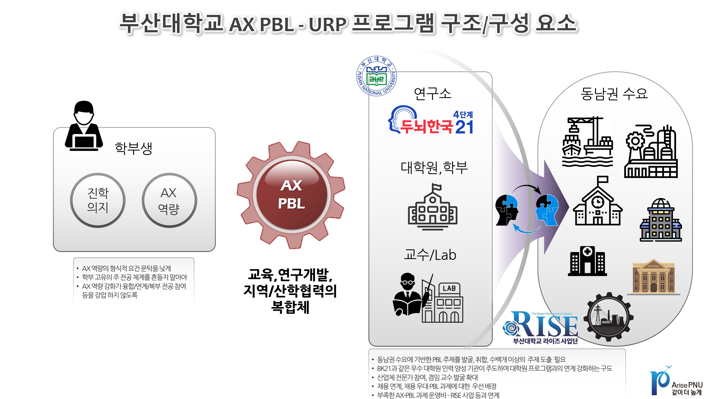

# 대학원 육성 — ARISE PNU AI

> 원본: _source/grad.html

## 내비게이션

- [홈](index.html)
- [대학원 육성](grad.html) (active)
- [I. 구심점 확립](part1.html)
- [II. 교육과정](part2.html)
- [III. 생태계](part3.html)
- [실행 항목](actions.html)
- [📱 QR](QRCode.html)

브랜드: AI · ARISE PNU AI

## 페이지 헤더

- (breadcrumb) [ARISE PNU AI](index.html) / 대학원 육성
- (badge) 대학원 육성 전략
- # 대학원 육성 전략 - Strategic Plan for the Expansion of Graduate Education
- 왜 지금 "대학원 육성"을 강조해야 하는가?
  - ✦ 대학원 육성은 부산대학교 **생존과 Level-UP**을 위한 **필수 조건**
  - ✦ 정부 거점 대학 지원 사업에서 부산대학교의 **우수성과 지원의 필요성**을 드러내는 것이 필요한 시점.
- (태그 pill) 📚 한국 고등교육의 현실 · 🏛️ 부산대 & 타대 비교 · 🚀 부산대 발전 계획

## 사이드바 목차

- [1. 한국 고등교육의 현실](#s1)
  - 학부 중심 대중교육
  - AI와 노동시장 전환
  - 지역별 현황 비교
- [2. PNU & 타대 대학원 비교](#s2)
  - 지역 거점 국립대
  - 서울대·KAIST·사립대
- [3. PNU 대학원 발전 계획](#s3)
  - 개요 · 목표
  - 현황 분석
  - 주요 발전 계획

참고 자료:

- 📈 동남권 학부·대학원 비교 — 인터랙티브 차트 [grad_s1_3_regional.html](grad_s1_3_regional.html)
- 📊 주요대학 대학원생 10년 — 재학생 현황 비교 [grad_s2_2_comparison.html](grad_s2_2_comparison.html)
- 👨‍🏫 전임교원 대학원생 비교 — 8개 대학 10년 추이 [grad_s3_2_faculty.html](grad_s3_2_faculty.html)
- 🔗 학석사 연계 현황 — UGLink 대시보드 [grad_s3_3_uglink_dashboard.html](grad_s3_3_uglink_dashboard.html)
- 📋 UGLink 홍보 가이드 — 학석사 연계 안내자료 [grad_s3_3_uglink_guide.html](grad_s3_3_uglink_guide.html)

---

# Section 1 — 📋 한국 고등교육의 현실

한국 고등교육의 구조적 문제와 지역 불균형을 객관적 데이터로 진단한다

## 1. 학부 중심의 대중/대량 교육

[OECD 원문 ↗](https://www.oecd.org/en/publications/education-at-a-glance-2025_1a3543e2-en/korea_252c9ed2-en.html)

> ⚠ 한국은 스스로 세계 최고 수준의 고등교육 국가라고 자랑 하지만, 실상은 **학부 중심(Undergraduate-focused)의 대중/대량(Mass) 교육**에 머물러 있다.

KPI:

- 한국 고등교육 이수율: **70.6%** — OECD 최고 수준 (1위권)
- 한국 석사 이상 비율: **3.1%** — EU 평균의 **1/7** · OECD의 **1/5**
- EU 석사 이상 비율: **20.8%** — Bologna Process 기반 석사 중심 구조

🏆 교육의 양은 세계 1위, 깊이는 OECD 최저

- ✦ 고등교육 이수율 **70.6%**로 압도적 세계 1위
- ✦ 석사 이상 비율 **3.1%**로 OECD 평균(16.7%)의 1/5 수준
- ✦ 학부는 "최종 학위"로 기능하며 대학원은 선택적 경로에 머물러 있다.

### 📊 OECD Education at a Glance 2025 — 25~34세 학력 분포 (2024 기준) (단위: %)

| 구분 | 고등교육 미만 | 고등학교 이하 | 고등교육 전체 | 단기 전문학위 | 학사 이상 | 석사 이상 ★ |
|---|---|---|---|---|---|---|
| 🇰🇷 한국 | 1.4% | 28.1% | 70.6% | 19.6% | 50.9% | 3.1% |
| 🇪🇺 EU (25개국) | 11.4% | 43.3% | 45.4% | 4.7% | 42.1% | 20.8% |
| 🌐 OECD 평균 | 12.8% | 39.1% | 48.7% | 7.7% | 42.9% | 16.7% |

핵심 포인트:

- **유럽·미국·일본에서 석사는 "선택"이 아닌 "기본"** — Bologna Process(유럽), 전문직 자격 제도(프랑스 RNCP, 독일 공학), 교원·사회복지사 석사 필수(핀란드·스웨덴) 등 제도적으로 "석사를 해야 자격이 생기는 구조"가 확립되어 있다.
- **한국의 역설 — "교육의 양은 세계 1위, 깊이는 OECD 최저"** — 고등교육 이수율 70.6%로 압도적 세계 1위이나, 석사 이상 비율 3.1%로 OECD 평균(16.7%)의 1/5 수준. 학부는 "최종 학위"로 기능하며 대학원은 선택적 경로에 머물러 있다.
- **한국 AI·첨단산업 고도화의 구조적 병목** — 석사급 전문 인력의 부족은 단순한 교육 문제가 아닌 산업 고도화와 연구 경쟁력의 근본적 제약이다. AI 시대에 더욱 심화될 전망이다.

### 🌍 국제 고등교육 구조 비교 (학부-대학원 역할 비교)

| 구분 | 석사의 역할 | 학부의 역할 | 구조 특징 | 대표 제도 |
|---|---|---|---|---|
| 🇪🇺 유럽 | 기본 학위 | 중간 단계 | 석사 중심 | Bologna Process · RNCP · Bac+5 |
| 🇺🇸 미국 | 직무별 필수 | 취업 가능 | 직무 중심 | MBA · Data Science · 전문직 석사 |
| 🇯🇵 일본 | 공학 기본 | 일부 중간 | 분야 중심 | 이공계 학부→대학원 진학 일반화 |
| 🇰🇷 **한국** | 선택 | **최종 학위** | 학부 중심 | 학부 대량 공급 · 조기취업 선호 |

출처: OECD Education at a Glance 2025, Korea Country Note (2024 기준 데이터)

## 2. AI와 노동시장 전환 — 산업 연계형 대학원의 필요성

> 🤖 **AI로 인해 신입 채용이 감소하는 환경** — 단순 취업 준비보다 **기업 데이터 기반 문제 해결 경험**을 제공하는 산업 연계형 대학원 교육이 보다 생산적이고 효과적인 인재 양성 경로다.

KPI:

- 기업의 변화: **신입 채용 큰 폭 감소** — 즉시 투입 가능한 인재·문제 해결 경험자 선호
- 청년 고용 현실: **체감실업률 20%** — 졸업 유예 증가 · "쉬었음" 청년 지속 확대
- 대학원의 전환: **문제해결 경험** — 연구자 양성 → 산업 문제 해결 경험 획득 과정

인용구:

> "AI-driven labor market shifts demand a transition from undergraduate mass education to problem-driven graduate education."

### 🔄 산업 연계형 대학원 vs 학부 스펙 취업 준비 비교

| 구분 | 학부 스펙 위주 취업 준비 | 산업 연계형 대학원 교육 |
|---|---|---|
| 활동 형태 | 자격증·공모전·어학 점수 축적 | 기업 데이터 기반 프로젝트 |
| 연구 방식 | 개인 역량 증명 중심 | 산학 협력 연구 |
| 기술 적용 | 이론·모의 실습 | AI 모델 실제 적용 경험 |
| 기업 수요 부합 | 낮음 — AI로 대체 가능 업무 | 높음 — 즉시 투입 가능 전문인력 |
| 생산성 | 취준 기간 경제적 비생산 | 연구·프로젝트로 가치 창출 |

핵심 포인트:

- **대학원을 "연구자 양성"에서 "산업 문제 해결 경험 획득 과정"으로 재정의** — 기업 데이터 기반 프로젝트, 산학 협력 연구, AI 모델 실제 적용 경험은 현재 학부 고학년의 스펙 위주 단순 취업 준비와 본질적으로 다르며 보다 생산적인 구조이다.
- **AI 시대 채용 변화** — 기업은 신입 공채를 줄이는 대신 즉시 투입 가능하고 문제 해결 경험이 있는 인재를 원한다. 대졸 취업률 악화·졸업 유예 증가·"쉬었음" 청년 확대는 이 구조적 변화의 결과다.
- **부산대학교 전략적 기회** — 산업 연계형 대학원 교육 확대는 단순한 대학원생 수 증가를 넘어, 동남권 기업과의 공동 문제 해결 생태계를 구축하고 지역 AX 전환을 선도하는 부산대의 핵심 차별화 전략이다.

🔴 대학원 계약학과를 통한 차별화 전략

- ✦ **채용 연계형 학부 계약학과** 유치의 현실적 난관
- ✦ 대학원 계약학과가 지역 성장엔진 분야 기업과 취업난을 겪고 있는 학생들을 위한 보다 실효적인 접근임을 부각
- ✦ 대학원 계약학과를 경쟁 대학 대비 우월성을 가질 수 있도록 노력

## 3. 지역별 고등교육 현황 (2016~2025)

> 🔴 **수도권 편중 심화 + 동남권 이중 위기** — 학부생은 감소, 대학원생은 성장하지 못하는 구조. 동남권은 인구 대비 대학원생 수에서 **전국 최하위**를 기록 중이다.

KPI:

- 동남권 학부생 감소: **−22.4%** — 31.3만 → 24.3만 (2016→2025) · 5극 중 최대 감소
- 수도권 학부생: **+0.4%** — 78.6만 → 78.9만 · 5극 중 유일하게 성장
- 동남권 대학원생: **−2.8%** — 3.4만 → 3.3만 · 수도권 +10.0%와 대비
- 동남권 인구 1000명당: **4.37명** — 수도권 7.79명의 56.1% · 중부권 10.24명의 42.7%

- 수도권은 학부 재적 학생 수 기준 5극 중 유일하게 성장하여 전국 편중 심화. 전국 평균은 208.5만→183.8만으로 −11.9%.
- 대학원 재적 학생은 전국 기준 33.3만→35.2만으로 +5.7% 증가했으나, 동남권은 오히려 −2.8% 감소. 수도권 +10.0%, 중부권 +6.7%와 뚜렷한 대조.
- 인구 1000명당 대학원생 수: 수도권 7.79명, 중부권 10.24명에 비해 동남권은 4.37명으로 수도권의 56%, 중부권의 43%에 불과. **전문 인재 양성 기반이 구조적으로 취약**하다.

📈 동남권 학부·대학원 통합 비교 (인터랙티브 차트)

- iframe 임베드: [grad_s1_3_regional.html](grad_s1_3_regional.html) (height 700)
- [↗ 별도 창에서 열기](grad_s1_3_regional.html)

출처: 대학알리미 연도별 학교별 재적학생 현황 (2016~2025)

---

# Section 2 — 🏛️ 부산대학교와 타대 대학원 비교

부산대 대학원의 우수성을 확인하고, 동시에 격차를 냉정하게 진단한다.

Section 2 Overview:

- 거점 국립대 중 규모 1위(5,525명), BK4 전국 2위 — 부산대 대학원의 **객관적 우수성**
- 서울대·KAIST·주요 사립대와의 격차가 10년간 **지속적으로 확대**되고 있다

## 1. 지역 거점 국립대 비교 — 부산대의 우수성

KPI:

- ① 규모 — 거점국립대 1위: **5,525명** — 2위 경북대(4,224명)보다 1,301명 많음 (2025)
- ② 연구 수월성 — BK4 사업: **전국 2위** — 서울대에 이어 2위 · 연구 역량 공인
- ③ 외국인 비율 — 거점대 최저: **7.67%** — 거점국립대 중 가장 낮은 외국인 비율

핵심 포인트:

- **① 거점 국립대 최대 규모** — 2025년 기준 일반대학원+전문대학원 재적학생 5,525명으로 거점국립대 1위. 2위 경북대(4,224명)와의 격차 1,301명. 동남권 고급 인재 양성의 중추 역할을 담당한다.
- **② BK4(BK21 4단계) 사업 전국 2위 — 연구 수월성의 증거** — 교육부·한국연구재단 선정 BK21 4단계 사업에서 서울대에 이어 전국 2위로 선정. 단순 규모를 넘어 질적 연구 수월성을 공인받고 있다.
- **③ 국내 전문 인력 양성 — 외국인 비율 7.67%로 거점대 최저** — 거점국립대 중 외국인 대학원생 비율이 과도하게 높아 국내 전문 인력 양성 기능이 왜곡된다는 우려가 제기됨. 부산대는 거점대 중 가장 건전한 구조를 유지하고 있어 AI 거점대학 사업 목표에 가장 잘 부합한다.

> 📄 거점 국립대 외국인 대학원생 비중 현황 — [관련 기사 (2026.04.15) ↗](https://v.daum.net/v/20260415130149836)

## 2. 서울대·KAIST·사립대와의 격차 확대

> 📉 부산대 대학원은 거점국립대 1위이지만, 서울대·KAIST 및 주요 사립대와의 격차가 **10년간 지속적으로 확대**되고 있다. 전임교원 대비 대학원생 비율도 감소 추세가 뚜렷하다.

KPI:

- 부산대 10년 변화: **−10.7%** — 6,191명(2016) → 5,525명(2025)
- KAIST 10년 변화: **+25.2%** — 6,701명 → 8,388명 (역전 후 격차 확대)
- 연세대와 격차: **2→4천명** — 2,012명(2016) → 4,088명(2025) 확대
- 성균관대 역전: **−2,208명** — 2016년 +363명 우위 → 2025년 역전

- 서울대 12,119명→13,044명, KAIST 6,701명→8,388명으로 증가. 부산대의 **서울대 대비 비율이 51.1%→42.4%**로, KAIST 대비 91.2%→66.3%로 하락.
- 연세대(주요 사립 1위) 8,203명→9,613명 증가. 부산대와의 격차가 2,012명→4,088명으로 10년 만에 2배 이상 확대.
- 성균관대 5,828명→7,733명 증가. 2016년에는 부산대보다 363명 적었으나 2025년에는 2,208명 역전됨.
- 전임교원 1인당 대학원생 수는 비교 대학 중 절대적으로 낮을 뿐 아니라 **감소 추세가 뚜렷**하다.

📊 주요 대학 대학원 재학생 현황 비교 — 최근 10년 (인터랙티브 차트)

- iframe 임베드: [grad_s2_2_comparison.html](grad_s2_2_comparison.html) (height 700)
- [↗ 별도 창에서 열기](grad_s2_2_comparison.html)

출처: 대학알리미 연도별 재적학생 현황 (2016~2025) · BK21 4단계 사업단 선정 현황

---

# Section 3 — 🚀 부산대학교 대학원 발전 계획

자기 성찰에 기반한 데이터 중심의 Top-Down · Bottom-Up 발전 계획

Section 3 Overview:

- 단기(2년) **+1,000명**, 중기(5년) **+2,000명**, BK4 성과 기반 **BK5 도전**
- 학교 차원 정책(Top-Down)과 학과·사업단 자발적 계획(Bottom-Up) **이중 전략** 동시 추진
- **PNU 1000 AX Talent** 프로그램 · 학석사 연계과정 요건 완화 · 지역 국립대 통합 검토

## 1. 개요 — 목표와 전략 방향

▶ 핵심 목표

- **+1,000명** — 대학원생 확대 (2년 내)
- **+2,000명** — 대학원생 확대 (5년 내)
- **BK5** — BK4 이상 성과 달성
- **진학 붐** — 대학원 진학 문화 조성

핵심 포인트:

- **현 총장 재임 중 구체적 발전 방향과 성과 목표 제시** — 단기(2년) 대학원생 수 1,000명 확대, 중기(5년) 2,000명 확대. BK4에서 검증된 연구 수월성을 기반으로 BK5 준비 작업을 조기 개시한다. 초기 대학원생 수는 지원금 규모에 큰 영향을 미치므로 사전 증원이 중요하다.
- **데이터 및 자기 성찰에 기반한 Top-Down · Bottom-Up 이중 전략** — 학교 차원의 정책·프로그램(Top-Down)과 학과·사업단 단위의 자발적 계획(Bottom-Up)을 동시에 추진하여 대학원 진학 붐을 조성한다.

## 2. 부산대학교 대학원 현황 분석

### 가. 전임교원 1인당 대학원생 수

> 📉 비교 대학에 비해 **절대적으로 낮을 뿐 아니라 감소 추세**가 뚜렷하다. 전임교원 1인당 대학원생 수는 대학원 연구 생산성과 지도 역량의 핵심 지표다.

📋 진단 요약

| 평가 항목 | 진단 | 의미 |
|---|---|---|
| 절대 수준 | 비교 대학 대비 낮음 | 연구 지도 역량 미활용 신호 |
| 추세 | 감소 추세 뚜렷 | 대학원 침체 경고 신호 |
| BK 영향 | 주요 평가 항목 | BK5 도전 시 개선 필수 |

💡 **대학원생 증원이 교원 역량을 극대화하는 직접 해법이다** — 이 지표가 낮고 감소 중이라는 것은 교원의 연구 역량이 미활용되고 있다는 신호이자 대학원 규모 부실의 핵심 지표다. 대학원생 수 확대는 단순한 목표가 아니라 교원 연구력을 실질적으로 작동시키는 구조적 해법이다.

📊 전임교원 1인당 대학원생 수 비교 — 주요 8개 대학 (2016~2025)

- iframe 임베드: [grad_s3_2_faculty.html](grad_s3_2_faculty.html) (height 680)
- [↗ 별도 창에서 열기](grad_s3_2_faculty.html)

출처: 대학알리미 전임교원 현황 · 대학원 재적학생 현황 (2016~2025)

### 나. 주요 학과의 대학원생 수 변화

> 🔍 영향력이 큰 주요 학과의 현황 파악 및 **학과별 맞춤 확대 전략** 마련이 필요하다. 성장 가능성이 높은 학과를 집중 지원한다.

#### 📋 부산대 일반대학원 학과별 재적학생 상위 15개 비교 (2017 · 2021 · 2026년 3월 기준) (단위: 명)

| 순위 | 2017년 3월 | 인원 | 2021년 3월 | 인원 | 2026년 3월 | 인원 |
|---|---|---|---|---|---|---|
| 1 | 기계공학부 | 305 | 기계공학부 | 258 | 기계공학부 | 287 |
| 2 | 경영학과 | 181 | 재료공학과 | 159 | 정보융합공학과 | 216 |
| 3 | 전기전자공학부 | 170 | 응용화학공학부 | 159 | 전기전자공학과 | 203 |
| 4 | 의학과 | 149 | 정보융합공학과 | 148 | 재료공학과 | 187 |
| 5 | 교육학과 | 130 | 경영학과 | 148 | 응용화학공학부 | 185 |
| 6 | 간호학과 | 118 | 전기전자공학과 | 134 | 의학과 | 138 |
| 7 | 재료공학과 | 116 | 간호학과 | 125 | 교육학과 | 100 |
| 8 | 조선·해양공학과 | 109 | 교육학과 | 124 | 융합학부 | 98 |
| 9 | 화학공학·고분자공학과 | 104 | 조선·해양공학과 | 112 | 조선·해양공학과 | 89 |
| 10 | 사회환경시스템공학과 | 102 | 사회환경시스템공학과 | 111 | 화학과 | 87 |
| 11 | 생명시스템학과 | 86 | 의학과 | 96 | 사회환경시스템공학과 | 83 |
| 12 | 치의학과 | 85 | 화학과 | 88 | 경영학과 | 83 |
| 13 | 정보컴퓨터공학부 | 84 | 음악학과 | 80 | 음악학과 | 80 |
| 14 | 영어영문학과 | 84 | 생명시스템학과 | 71 | 외국어로서의한국어교육전공 | 69 |
| 15 | 지구환경시스템학부 | 82 | 치의학과 | 69 | 생명시스템학과 | 69 |

※ 일반대학원 기준 · ★ 2026년 순위 상승 주목 학과

출처: 부산대학교 대학원 재적학생 현황 DB (2017 · 2021 · 2026년 3월 기준)

▶ 패턴 분석

- ⚠️ **기계공학부 — 1위 유지이나 소폭 감소 및 정체** — 305명(2017) → 258명(2021) → 287명(2026)으로 다소 회복했으나, 10년 전 대비 6% 감소. 규모 1위를 유지 중이나 장기 추세 모니터링이 필요하다.
- 🔴 **경영학과 — 대폭 감소 경고** — 2위(181명) → 5위(148명) → 12위(83명)으로 급락. 10년간 절반 이하로 감소. 학과 차원의 원인 분석과 Bottom-Up 대응 계획이 필요
- ⭐ **정보융합공학과 — AI·데이터 수요 반영의 성공 사례** — 2017년 순위권 밖 → 2021년 4위(148명) → 2026년 2위(216명). 산업 변화에 민감한 AI·데이터 중심 학과의 가능성을 증명한다.

## 3. 주요 발전 계획

### 가. Top-Down — 학교 차원의 정책 · 프로그램

> ⚠️ **정책 기조 : 대학원 성과를 대학 자원 배분의 핵심 척도로** — 대학원생 수, BK 사업 선정 여부 등을 교수 TO · 공간 · 예산 배분의 중요 지표로 공식화하여, 대학원 역량 강화에 투자하는 학과·교수에게 실질적 인센티브를 부여한다.

#### 🚀 PNU 1000 AX 인재 양성 프로그램 (Top-Down 핵심 프로그램)

(이미지 src: ./image/AX-PBL.jpg · 캡션/alt: PNU AX 1000 프로그램 개념도)

- **대상** — 학부 3·4학년 중 대학원 진학 의지가 있는 최대 1,000명을 학부연구생으로 지원 (3학년 2학기·4학년 1·2학기 각 300여명)
- **지원 규모** — 1인당 월 25만원 / 학기 150만원 / 연 300만원, 최대 연 30억원 특별 장학금 지원
- **운영 방식** — 연구소·대학원·학부·산업체 연계 URP/패스트트랙 AX 전문 인재 양성. 학부생 1,000명 + 대학원생·기업체·연구원·교수 등 수천 명이 동남권 AX 프로젝트를 공동 수행하는 생태계형 프로그램
- ✦ 진로를 고민하는 3·4학년 수천 명이 직접 수혜·참여하는 학생 체감도가 높은 프로그램

#### 👥 학석사 연계과정 요건 완화 & 홍보 강화 (Top-Down 제도 개선)

학부 우수 학생의 대학원 진학을 촉진하기 위해 **학석사 연계과정 신청 요건을 완화**하고, 재학생 대상 홍보를 체계화한다. 진학 문화 조성의 핵심 제도적 기반이다.

관련 링크:

- 📊 학석사 연계 현황 대시보드 [grad_s3_3_uglink_dashboard.html](grad_s3_3_uglink_dashboard.html)
- 📚 연계 프로그램 홍보 (기존 예) [https://math.pusan.ac.kr/math/11240/subview.do](https://math.pusan.ac.kr/math/11240/subview.do)
- 📚 연계 프로그램 홍보 (신규 예) [grad_s3_3_uglink_guide.html](grad_s3_3_uglink_guide.html)

#### 💡 Idea 수준 (검토 중)

- **학부 입시에서 "학석사통합과정" 도입**
  - ✦ 학석사통합과정을 위한 별도 모집단 구성은 현실적 어려움이 있을 거로 보임.
  - ✦ 통합과정 신청자에 가산점 부여 방식으로 유인책 마련 가능.
- **지역 국립대와의 대학원 통합**;
  - ✦ **BK5를 앞두고 통합 이익이 큰 일부 학과부터** 단계적 추진. [관련 활동 : 부산대-부경대 부산과학기술원 ↗](./pdf/부산대부경대-부산과학기술원.pdf)

### 나. Bottom-Up — 학과·BK 사업단 단위의 자발적 계획

> **대학원 학과 / BK 연구사업단에 협조 공문 발송** — 현황 파악(대학원생 수 변화, 전임교원 1인당 대학원생 수), 대학원생 미지도 교원 현황 파악·원인 분석, 그리고 BK5·AI/AX 시대에 대응한 대학원 발전 계획 제출을 요청한다.

▶ Bottom-Up 3단계 프로세스

1. **현황 진단** — 대학원생 수·전임교원 지도 비율·미지도 교원 현황 파악
2. **원인 분석** — 감소 원인 규명·성장 가능 학과 발굴·장애 요인 도출
3. **발전 계획 제출** — BK5·AX 시대 대응 학과별 맞춤 대학원 발전 계획 수립

## 푸터

ARISE PNU AI — 대학원 육성 전략 · Strategic Plan for the Expansion of Graduate Education
Pusan National University · 부산대학교 AI 거점대학 사업

## 미디어·링크 목록

이미지:

-  (src: ./image/AX-PBL.jpg)

iframe src:

- grad_s1_3_regional.html (동남권 학부 대학원 통합비교, height 700)
- grad_s2_2_comparison.html (주요 대학 대학원 재학생 현황 10년 비교, height 700)
- grad_s3_2_faculty.html (전임교원 대학원재학생 비교, height 680)

내부 페이지 / 참고 자료 링크:

- [index.html](index.html)
- [grad.html](grad.html)
- [part1.html](part1.html)
- [part2.html](part2.html)
- [part3.html](part3.html)
- [actions.html](actions.html)
- [QRCode.html](QRCode.html)
- [grad_s1_3_regional.html](grad_s1_3_regional.html)
- [grad_s2_2_comparison.html](grad_s2_2_comparison.html)
- [grad_s3_2_faculty.html](grad_s3_2_faculty.html)
- [grad_s3_3_uglink_dashboard.html](grad_s3_3_uglink_dashboard.html)
- [grad_s3_3_uglink_guide.html](grad_s3_3_uglink_guide.html)

다운로드 파일 (PDF):

- ./pdf/부산대부경대-부산과학기술원.pdf (관련 활동 : 부산대-부경대 부산과학기술원)

외부 URL:

- https://www.oecd.org/en/publications/education-at-a-glance-2025_1a3543e2-en/korea_252c9ed2-en.html (OECD 원문)
- https://v.daum.net/v/20260415130149836 (관련 기사 2026.04.15)
- https://math.pusan.ac.kr/math/11240/subview.do (연계 프로그램 홍보 기존 예)
