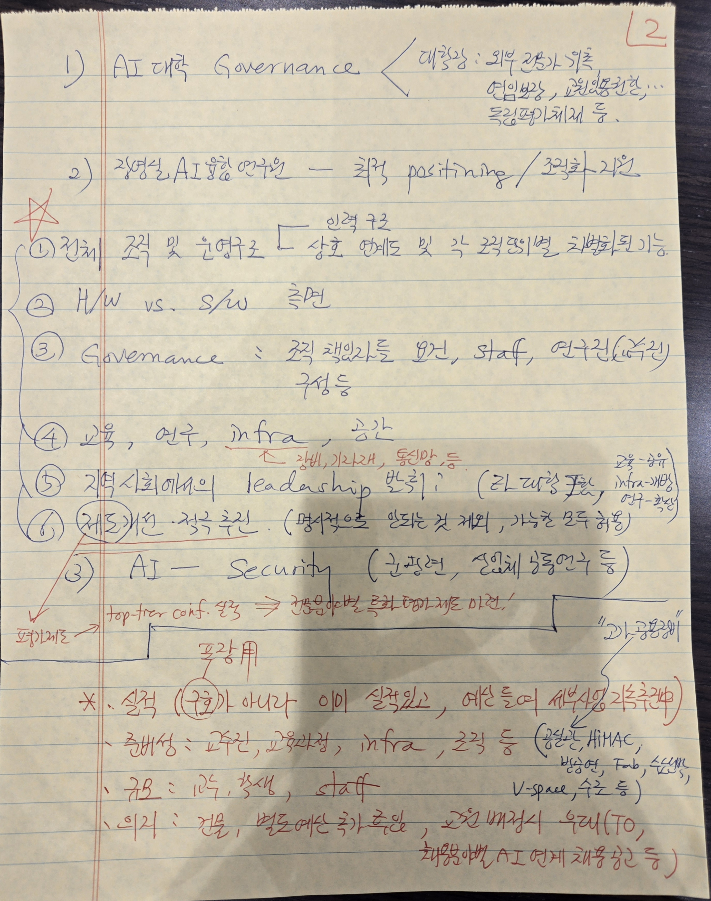

# 2026-05-08 총괄TF 미팅 — ARISE PNU AI

> 원본: _source/meeting_20260508.html

## 내비게이션

- [제안서](index.html)
- [실행항목](actions.html)
- [회의록](meeting_index.html) (active)

브랜드: PNU · ARISE PNU AI

## 헤더

[← 회의록 목록](meeting_index.html)

- 총괄 TF 미팅
- 2026년 5월 8일 (금)

# AI 거점대학 총괄 TF 미팅

참석: 김종덕 · 백윤주 · 송길태 · 이해준 · 유영환 · 최윤호

## 목차

0. [경과](#s0)
1. [홍보 및 활동 시스템 구축](#s1)
2. [가시적 협력 활동 이벤트](#s2)
3. [소속 학과의 적극성](#s3)

## 0. 경과

### 직전 활동

- 2026.05.07 AI 거점대학 제안서 초안 발표

### 총장님 피드백 (2026.05.07)

제안발표 후 총장님 피드백 자료

캡션: 📐총장님 메모 1/3

캡션: 📐총장님 메모 2/3

캡션: 📐총장님 메모 3/3

> 📰 참고 기사: [전북대학교 AI 대학 신설 — 교수신문](https://www.kyosu.net/news/articleView.html?idxno=205548)

## 1. 홍보 및 활동 시스템 구축

> **예산:** 본부 지원 자금 3,000만원 + α (필요 시 내부 충당)

### 도메인 체계 구성안 (신규/개편)

| 역할 | 도메인(안) | 구분 |
| --- | --- | --- |
| **AI 거점대학 메인** | arise-ai.pusan.ac.kr | 신규 |
| AI 대학 | ai.pusan.ac.kr | 신규 |
| 장영실AI융합교육원 | airc.pusan.ac.kr *또는* axrc.pusan.ac.kr | 신규 |
| AI융합교육원 | aiedu.pusan.ac.kr | 개편 |
| AX정보화혁신본부 | uitc.pusan.ac.kr | 연계 |
| AI 대학원 | aigs.pusan.ac.kr | 연계 |
| DS 대학원 | ds.pusan.ac.kr | 연계 |

## 2. 가시적 협력 활동 이벤트

### 부산대학교 특성화 Alliance 11개 기관 (연구처(처장 이동근) 주도)

1. 한국과학기술연구원 (KIST)
2. 한국기계연구원 (KIMM)
3. 한국생산기술연구원 (KITECH)
4. 한국재료연구원 (KIMS)
5. 한국전기연구원 (KERI)
6. 한국항공우주연구원 (KARI)
7. 한국해양과학기술원 (KIOST)
8. 한국해양수산개발원 (KMI)
9. 한국직업능력연구원 (KRIVET)
10. 한국조선해양기자재연구원 (KOMERI)
11. 선박해양플랜트연구소 (KRISO)

**협력 대학:** 서울대 · 한양대 · 인하대 · 부경대 · 해양대 · 창원대 · UNIST

### 장영실AI융합연구원

#### AI/AX 연구 연계 강화

- 5개 센터 이전

#### 앵커 기업 기반 연구 센터 구체화

1. 삼성중공업
2. 은성의료재단
3. 한국재료연구원

#### 전략 특화 연구 센터 구성

- **AI Context Center**
  - 국방 — 해군사관학교, ADD 등
  - 항만물류 — 부산항만공사 등
  - 조선해양 — 조선해양공학과 협력, 중소조선연구원 등
  - 의료
- **AI E&E Center**
  - 부산 교육청 등

### AI 대학/대학원 협력

#### AI 우수 대학원 협력

- KAIST, UNIST — 양재 국가 AI 연구 거점(5년간 국비 440억, KAIST 주관; 고려대·연세대·포스텍 참여) 및 UNIST AI대학원과 전략적 연계
- 서울대 (검토)

#### AI중심대 연계 — 성균관대 컨소시엄

- 가천대 · 고려대 · 서강대 · 성균관대 · 순천향대 · 숭실대 · 연세대
- 성균관대 · 가천대 · 순천향대 → 부트캠프 사업 선정

#### 지역 대학 및 지역 협력

- 학장 협의체
- 교육청 등 평생교육
- BIPA, BISTEP (검토)

#### 학내 협력

- 의과대학
- 나노대학 / 학부대학

#### 해외 협력

- 글로벌 AX 선도 연구 기관: 싱가포르국립대 · 스탠포드대학교 · UC Berkeley

#### 우수 AI 기업

- [업스테이지](https://pnurise.pusan.ac.kr/pnurise/14738/subview.do) (PNU RISE 협력)
- 카카오테크캠퍼스 (검토)
- *전북대 사례: 네이버클라우드 · 퓨리오사AI · 업스테이지 · 아마존클라우드 등 협력 파트너*

## 3. 소속 학과의 적극성

### 학과 차원의 공감대 형성 / 대학원 육성 가시화

#### 대학원 육성 활동 가시화

- PNU AX 1000 인재 양성 프로그램 등을 활용한 대학원 진학 붐 조성
- 홍보 페이지 구축
- 홍보 이벤트 — 부트캠프 행사 형태 참고

#### 제도 및 기반

- 학부 연구생 제도 검토
- 학부 연구생 학습 공간이나 지원 (강의실 활용)

### AX-PBL 주제 선도적 발굴

- 주제 취합 페이지 구축
- [공학교육혁신센터](https://picee.pusan.ac.kr/picee/70934/subview.do) 활동 참고 — [미래AX생활가전 프로젝트](https://picee.pusan.ac.kr/picee/42955/subview.do) 등

### 혁신적 교과과정과 운영

- **집중 교육:** Half Semester 제도 선도적 도입
- **(Institutional) AI/AX 교과목 개발 계획 수립**
  - 대학원 공통 교과
  - AI 역량 교과에 대한 교수 역할 강화

---

ARISE PNU AI — 부산대학교 AI 거점대학 추진 TF | Internal Use Only

## 미디어·링크 목록

### 이미지

-  — src: image/제안발표0507_총장님_Feedback_1of3.jpg (캡션: 📐총장님 메모 1/3)
-  — src: image/제안발표0507_총장님_Feedback_2of3.jpg (캡션: 📐총장님 메모 2/3)
-  — src: image/제안발표0507_총장님_Feedback_3of3.jpg (캡션: 📐총장님 메모 3/3)

### 파일/PDF 링크

- 없음

### iframe

- 없음

### 외부 URL / 하이퍼링크 (verbatim)

- index.html (nav 브랜드)
- index.html (제안서)
- actions.html (실행항목)
- meeting_index.html (회의록 / 회의록 목록 back-link)
- https://www.kyosu.net/news/articleView.html?idxno=205548 (전북대학교 AI 대학 신설 — 교수신문)
- https://pnurise.pusan.ac.kr/pnurise/14738/subview.do (업스테이지)
- https://picee.pusan.ac.kr/picee/70934/subview.do (공학교육혁신센터)
- https://picee.pusan.ac.kr/picee/42955/subview.do (미래AX생활가전 프로젝트)
