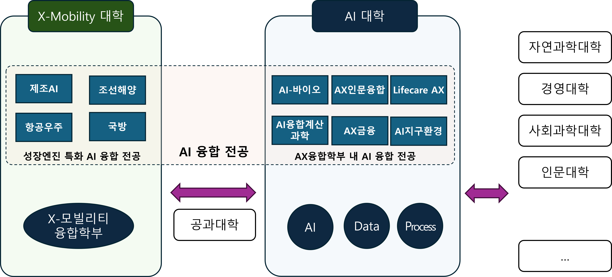
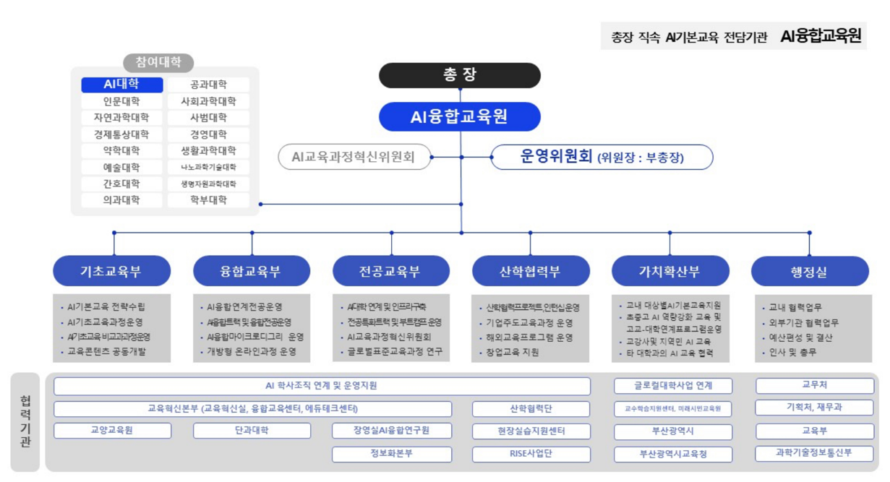
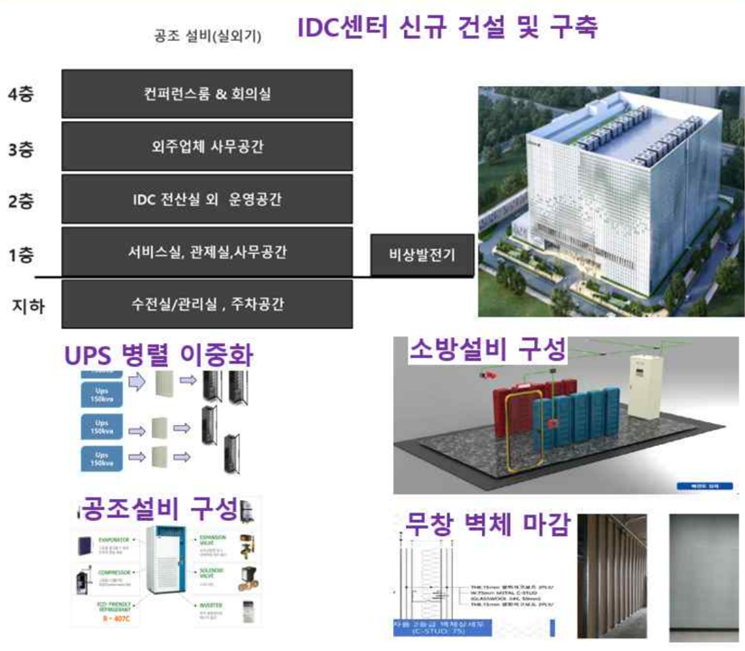
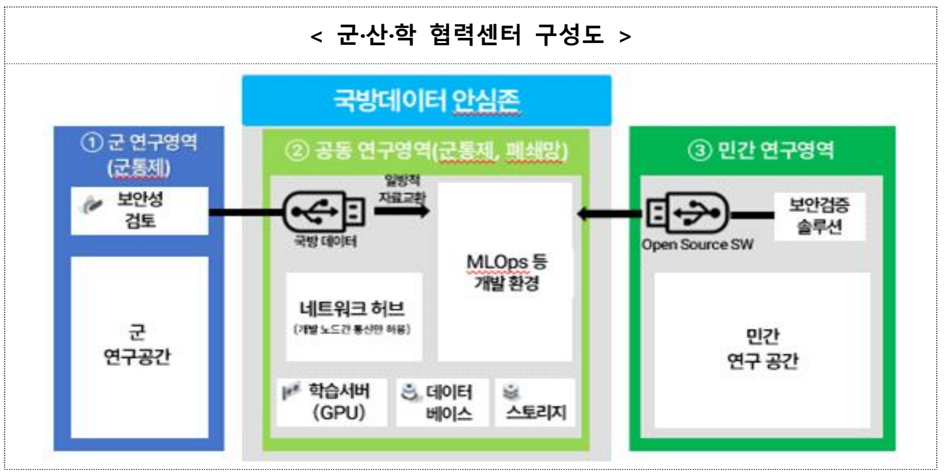

# Part I — 구심점 확립 및 기반 확충 | ARISE PNU AI

> 원본: _source/part1.html

## 내비게이션

- [홈](index.html)
- [대학원 육성](grad.html)
- [I. 구심점 확립](part1.html) (active)
- [II. 교육과정](part2.html)
- [III. 생태계](part3.html)
- [실행 항목](actions.html)
- [📱 QR](QRCode.html)

브랜드: AI · ARISE PNU AI

## 페이지 헤더

- (breadcrumb) [ARISE PNU AI](index.html) / Part I
- (badge) PART I · ver 0.5071
- # 대학 AI 교육·연구의 구심점 확립 및 기반 확충
- AI 관련 학사조직 재편, 총장 직속 AI 거버넌스 기구 구성, AI 인프라 확충·집적화를 통해 부산대학교를 **동남권 AI 교육·연구의 실질적 구심점**으로 확립합니다.
- (태그 pill) 🏛️ AI 학사조직 개편 · ⚙️ AI 거버넌스 설치 · 🖥️ AI 인프라 확충·집적화

## 사이드바 목차

- [1. 개요](#overview)
- [2. A.U.R.A. 계획](#aura)
- [3. AI 학사조직 개편](#org)
  - ADP+X 구조
  - AI대학 우수성
  - AX 융합전공
- [4. AI 거버넌스](#gov)
  - 거버넌스 구조
  - 전담기구 권한
- [5. AI 인프라 확충·집적화](#infra)
  - 개요
  - PNU-AXIS
  - Hub Space
  - AIaaS · MLSecOps

참고 자료:

- 📄 과업1 가이드라인 — 교육부 공식 과업 명세 PDF [pdf/교육부-AI거점대학-과업1-대학AI 교육연구의 구심점 확립 및 기반 확충.pdf](pdf/교육부-AI거점대학-과업1-대학AI%20교육연구의%20구심점%20확립%20및%20기반%20확충.pdf)
- 🌟 부산대 AX AURA — PNU-AX 마스터플랜 소개 [부산대_AX_AURA.html](부산대_AX_AURA.html)
- 🏛️ AX융합학부 융합전공 — 18개 융합전공 목록 시각화 [AX융합학부_융합전공.html](AX융합학부_융합전공.html)

---

# Section 1 — 📋 개요

대학 AI 교육·연구의 구심점 확립 및 기반 확충 분야 (과업 1) 교육부 지정 세부 과업과 부산대학교 접근 방안

> 📄 대학 AI 교육·연구의 구심점 확립 및 기반 확충 분야: [과업1 가이드라인 PDF ↗](pdf/교육부-AI거점대학-과업1-대학AI%20교육연구의%20구심점%20확립%20및%20기반%20확충.pdf)

세부 과업 (3개):

- 🏛️ **AI 학사조직 개편** — AI 융합이 필요한 여러 단과대학·학과 간 연계를 기반으로 AI 융합교육과정을 개발·운영하는 학사조직 마련
- ⚙️ **AI 거버넌스 설치** — 학내 AI 융합교육의 전방위 확산을 위한 총장 직속 전담기구 마련 및 다양한 구성원 참여 유도
- 🖥️ **AI 인프라 확충·집적화** — GPU 서버, 실습실 등 AI 교육·연구 인프라 확충 및 클라우드 기반 컴퓨팅 서비스 지원 (별도 장에서 상세 기술)

📌 접근 전략

**준비되어 있음 · 규모 · 우수성**을 핵심 키워드로 강조. 부산대학교는

- ✦ A.U.R.A. 마스터플랜
- ✦ 총장 직속 3개 AI 전담 기구
- ✦ AI대학 (2027년 출범) 등

실질적 AI 대전환 체계를 이미 마련하였음을 부각

---

# Section 2 — 🌟 부산대학교 A.U.R.A. 계획

전사적 AI 대전환을 위한 PNU-AX 마스터플랜
**A**I Philosophy · **U**nified Research · **R**einforced Education · **A**daptive Administration

> 🔗 별도 제작된 상세 소개 페이지 참조: [부산대 AX AURA 소개 페이지 열기 ↗](부산대_AX_AURA.html)

📐 마스터플랜 규모:

- ✦ 8대 전략목표
- ✦ 22개 전략과제
- ✦ 47개 실행과제
- ✦ 3개년 로드맵

🏆 주요 성과 (2025~2026):

- ✦ 한국의 경영대상 AI 혁신 부문 대상
- ✦ University AI-MASTER 국내 대학 최초 인증
- ✦ 지도교수상담 AI 도우미 국립대 최초 구축
- ✦ 산지니 AI 플랫폼 자체 구축·운영

---

# Section 3 — 🏛️ AI 학사조직 개편

AI 관련 전공의 집적화와 여러 단과대학·학과 간 연계를 주도하는 구심점으로서 AI단과대학을 구성합니다.

## ① AI대학 구성과 설립 — ADP+X 구조

AI대학은 **AI · Data · Process + X(AX)**의 통합 구조로 설계되어, 단순 기술교육을 넘어 다양한 도메인에서 AI 혁신을 실현하는 인재를 양성합니다. 2027년 3월 출범 예정입니다.

### 다이어그램: 부산대학교 AI대학 — ADP+X 구조

부제: AI is created from Data, applied to Process, and realized as AX.

- **Data** — 데이터사이언스학부 (+ 통계학과) — AI를 만들고 성장시키는 원천 자원
- **AI** — AI컴퓨터공학부 — 데이터로부터 지능을 창출하고 지속 진화
- **(중심) AI대학 / AX (AI Transformation)**
- **Process** — 산업공학부 — 현실 세계 활동 구조화, Data 생성, AI 적용의 대상
- **X (AX)** — AX융합학부 — AI·Data·Process 통합, 도메인 혁신 실현

대학원 (BK21) 연계: AI대학원 / 데이터사이언스대학원 / 산업공학과 대학원

전 학문 분야 확산: 다양한 AX 융합전공으로 학내 전 학문분야 AX 연계 및 확산

슬로건: **ADP is the foundation, AX is the realization.** — AI · Data · Process의 통합을 통해 다양한 도메인에서 혁신을 실현하는 전환 패러다임

## ② 부산대학교 AI대학의 우수성

규모·우수성·융합성 세 가지 축에서 동남권 최고 수준의 AI 교육 역량을 입증합니다.

- **424명** — 2027 학부 입학 정원 — 다른 대학들의 AI단과대학 입학정원 규모는 보통 150여명 수준, 가장 적극적이라고 알려진 전남대도 250여명 수준, 규모가 클 뿐 아니라 ADP+X라는 짜임새 있는 구성
- **300+** — BK21 대학원생 — AI대학원, 데이터사이언스대학원, 산업공학과 대학원 등 ADP 분야의 대학원을 활발히 운영 중이며 3개 분야 모두 BK21 사업에 선정되었음. BK21 사업단에서 300명 이상의 대학원생 활발히 연구 중
- **18개** — AX 융합전공 — 바이오·신약, 푸드테크, 인문·사회, 경영, 제조AI, 항만물류, 디지털트윈, 스마트시티 등 9개 분야

⚠️ **향후 보완 필요:** 전임 교원 수 및 확충 계획, 겸임 교원 확보 내역 추가 필요

### AI대학 대학원과 BK21 연구사업단 현황

| 사업단명 | 소속 대학원 | 특성 |
|---|---|---|
| **동남권4차산업혁명리더양성사업단** | AI 대학원 (대학원 정보융합공학과 — AI전공, 컴퓨터공학전공) | AI 전문 석·박사 인재 양성, 동남권 4차 산업혁명 리더 배출 |
| **GLOW-AI 혁신인재양성교육연구단** | 데이터사이언스 대학원 | 데이터사이언스·AI 혁신 인재 양성, 글로벌 AI 교육연구 네트워크 구축 |
| **글로벌 공급망 혁신을 위한 산업 빅데이터교육연구단** | 대학원 산업공학과 | 공급망·빅데이터 분석, 제조·물류·서비스 AI 융합 및 Process 혁신 연구 |

> 📄 AI대학 구성도 (대학원 부각): [출처 - AI대학 신설(안) 보고서 ↗](pdf/부산대_AI대학구성도_출처AI대학신설안.pdf)

## ③ AX융합학부 — 지역 성장 엔진 분야 융합전공

단순 AI 기술 교육을 넘어, 지역 성장 엔진 산업과 직결된 9개 분야 18개 AX 융합전공을 통해 다양한 단과대학·학과와 연계합니다.

> 🔗 상세 목록 시각화 페이지: [AX융합학부 융합전공 목록 열기 ↗](AX융합학부_융합전공.html)

분야 태그 (9개 분야):

- 🧬 바이오·신약 (2개)
- 🌾 푸드테크AX (1개)
- 📚 인문·사회·문화 (2개)
- 💼 경영·경통 (2개)
- 🏭 제조AI (3개)
- ⚓ 항만물류AI (1개)
- 💻 AX계산과학·디지털트윈 (4개)
- 🌍 스마트시티·환경 (2개)
- ⛵ 조선해양 (1개)

### 🏗️ AX 융합전공 소속 구성 - AI대학 + X모빌리티대학

**AI 대학 · AX융합학부 — 일반 AX 융합전공:**

- 바이오·신약, 푸드테크AX, 인문·사회·문화, 경영·경통, AX계산과학·디지털트윈, 스마트시티·환경, 조선해양 등
- ✦ 기존 융합전공 소속 변경·개편 검토
- ✦ [교육혁신본부 융합교육센터](https://con.pusan.ac.kr/con/74187/subview.do) 기존 전공 재편 반영

**X-모빌리티 대학 내 생성 — 성장엔진 특화 AI 융합전공:**

- 항만물류AI, 제조AI, 자율주행·모빌리티, 조선해양 AX 특화 등
- ✦ 동남권 지역 성장엔진 산업 직결
- ✦ X-모빌리티 대학 제안 내용과 연계

(이미지 src: image/AX융합전공과대학구조.png · 캡션: 📐 AX 융합 전공 - AI 대학 + X-Mobility 대학 구조)

💡 융합전공 구성 예시는 최종 명칭이 아닌 분야 예시이며, 실제 전공명과 다를 수 있습니다.

---

# Section 4 — ⚙️ AI 거버넌스

총장 직속의 3개 AI 전담기구와 교학부총장 중심의 의사결정 체계로 전사적 AI 대전환을 실행합니다.

## ① AI거점대학 거버넌스 구조

### 부산대학교 AI 거점대학 거버넌스 체계 (조직도)

- 총 장 (부산대학교)
  - 교학부총장 (AI 거점대학 사업 추진의 장)
    - 운영위원회 (전략 조율 및 의사결정 지원)
      - 🏛️ **AI 대학** — AI 전문·융합 학사 교육의 핵심 조직 (2027.3 출범)
      - 🎓 **AI융합교육원** — 학내 AI 기초·융합교육 전방위 확산 컨트롤타워
      - 🔬 **장영실 AI융합연구원** — AI 기반 융합연구 선도·혁신 창출 연구 컨트롤타워
      - ⚙️ **AX정보화혁신본부** — 디지털 인프라·플랫폼 구축 실행 컨트롤타워

> 📄 AI대학 거버넌스 구성도, X-Mobility와의 관계 표현(?) : [출처 - AI대학 신설(안) 보고서 ↗](pdf/부산대_AI거버넌스_출처AI대학신설안.pdf)

## ② 전담 기구의 역할과 권한

- ✦ **교학부총장**이 AI 거점대학 사업 추진의 장으로서 역할하며, AI대학·AI융합교육원·장영실AI융합연구원·AX정보화혁신본부 간 원활한 학내 의견 조율을 주도합니다.
- ➤ **기획 및 예산 배분**, **교내 위원회 권한 위임**을 통한 대체 심의 등 실질적 의사결정 권한 부여
- ✦ AI대학 신설안에 제시한 **AX선도위원회(위원장 : 대외전략부총장, X-모빌리티 대학 사업 총괄?)**을 참고하여 X-모빌리티 대학과의 연계 구조 포함

🏗️ **실체가 있는 조직 — 이미 구성·운영 중** — 3개 전담기구는 계획 단계가 아닌 **실제 조직과 구성원을 갖추고 현재 운영 중**인 기구입니다. 부산대학교의 AI 대전환이 체계적 실행 단계에 있음을 나타냅니다.

### 🎓 AI융합교육원

학내 AI 기초 및 융합 교육의 전방위 확산을 위한 **총장 직속** AI 융합교육 컨트롤 타워.

주요 역할:

- 전교생 대상 AI 기초교육 기획·운영 (인공지능과 디지털 사고)
- 비전공 교원 AI 연수 프로그램 운영
- AI 역량 교육 교과목 개발·운영
- AI 융합 교과목 개발 지원
- AI Enhanced 교육 콘텐츠 표준화·확산

(향후 보완) 원장, 주요 구성원, 조직도 추가 예정

(이미지 src: image/AI융합교육원.png · 캡션: 📐 AI융합교육원 구조도 (클릭하여 확대))

### 🔬 장영실AI융합연구원

AI 기반 융합 연구를 선도하고 혁신을 창출하는 **총장 직속** AI 융합연구 컨트롤 타워.

주요 역할:

- AI 실전형 교육(AX-PBL) 기획·운영 주도
- 대학원 AI 공통 핵심 교육과정 개발
- Sovereign AI 특화 교육·연구 연계
- 동남권 산업 데이터 기반 AX 연구 수행
- Top-Down형 전략 연구 과제 관리

📌 실체가 있는 기존 연구센터를 산하 기관으로 등록하려면 **연구시설**이 아닌 **부속기관**으로 격상 필요 - 연구진흥과
(향후 보완) 원장, 주요 구성원, 센터·연구단 조직도 추가 예정

### ⚙️ AX정보화혁신본부

부산대 AI Transformation을 실현하는 디지털 인프라·플랫폼 구축의 **실행 컨트롤 타워**.

주요 역할 및 성과:

- 산지니 AI 플랫폼 자체 구축·운영 중
- 지도교수상담 AI 도우미 국립대 최초 구축
- AI 거버넌스 데이터 체계 관리
- AI 교육·연구용 컴퓨팅 인프라 운영
- University AI-MASTER 인증 지원

(향후 보완) 본부장, 주요 구성원, 세부 조직도 추가 예정

---

# Section 5 — 🖥️ AI 인프라 확충·집적화

분산된 GPU 자원의 전략적 집적과 MLOps·보안 플랫폼 기반의 AI Computing as a Service로, 교육·연구·산학협력의 컴퓨팅 환경을 혁신합니다.

## ① AI 인프라 구축 비전과 구성 체계

🎯 비전: **"AI for All, Secure for Strategic"** — 누구나 AI 컴퓨팅을 활용하는 개방형 환경을 구축하고, 전략적 연구에는 철저한 보안을 보장합니다.

2-트랙:

- 🧠 **PNU-AXIS** (AI Transformation & Intelligent Systems) — 분산된 연구실 GPU를 하나의 통합 허브로 집적. 교육용·연구용 Pool 분리 운영 및 AIaaS 서비스 제공
- 🏗️ **PNU AI Innovation Hub Space** — AI 교육·연구·산학협력이 물리적으로 집약되는 개방형 복합 공간. PNU-AXIS와 유기적 연동

주요 구성 요소 (4개):

- ⚡ **컴퓨팅 인프라** — GPU 집적 허브 PNU-AXIS (100+→1,000+ GPU)
- 🏛️ **물리적 공간** — 교육·연구·협업 복합 공간 Hub Space
- ☁️ **클라우드 플랫폼** — MLOps 기반 AIaaS + 하이브리드 클라우드
- 🔒 **보안 체계** — MLSecOps Dual-Zone (폐쇄·개방 이중 영역)

## ② PNU-AXIS — AI 컴퓨팅 인프라 집적 허브

현재 교내 GPU 자원(303+장)이 연구실 단위로 분산되어 있어 전력·냉각·관리 비효율이 발생합니다. **PNU-AXIS**는 분산 자원을 단일 허브로 집적하여 교육·연구·산학협력의 컴퓨팅 파워를 통합 관리 체계 아래 운영합니다.

### 현재 GPU 보유 현황

| 구분 | 하이엔드 | 기타 | 합계 |
|---|---|---|---|
| PNU-IDC 입주 | 23장 | 140장 | 163장 |
| 교내 학과 (교육용) | — | 245장 | 245장 |
| 합계 | 23장 | 385장 | 303+장 |

### 데이터센터 사양

- ⚡ **전력:** 2MW 이중화 (GPU 100대×10kW + 기타 400kW)
- 🔗 **네트워크:** 400Gbps+ InfiniBand / 고성능 이더넷
- 🛡️ **가용성:** Tier 2 이상 (연간 22h 이하 다운타임)
- 💰 **전력 비용:** 약 15억원/년

(이미지 src: image/pnu_axis_idc.png · 캡션: 📐 PNU-AXIS IDC (클릭하여 확대))

### 향후 확보 계획 (총 800장, 500억원)

| 구분 | 모델 | 수량 | 주요 용도 |
|---|---|---|---|
| **연구 서비스** | H200 | 400장 | 초거대모델 학습·추론 (400B+ 모델) |
| **시각화 서비스** | L40S | 200장 | 중형 LLM, 이미지 생성 (7B~14B) |
| **가상화 서비스** | A10/A30 | 200장 | 챗봇·임베딩·교육 실습 |

GPU Pool:

- 🎓 **교육용 GPU Pool** — 전공·교양 실습 수업 자동 배정 / 학생 AI 실습 크레딧 연계
- 🔬 **연구용 GPU Pool** — LLM 학습·도메인 AI 연구 / SLA 기반 자원 배분, 연구비 차감 과금

🔄 집적화 이관 인센티브:

- ✦ 이관 시 혜택: 전기료 면제 + 우선 사용권 + 신규 자원 매칭
- ✦ 노후 서버 단계적 폐기 후 통합 자원으로 전환
- ✦ 신규 도입은 중앙구매(공동조달)로 일원화

🌐 **부·울·경 AI 컴퓨팅 거점** — PNU-AXIS는 부산대 전용을 넘어, 부·울·경 지역 대학·산업체·스타트업이 공동 활용하는 **AI 컴퓨팅 지역 허브**로 기능합니다. RISE 사업·AI 컴퓨팅 바우처 사업과 연계하여 지역 AI 생태계를 견인합니다.

> ※ HTML 주석 처리된 비공개 금액 정보 (inetguru 제거 표기): 건축비 300억 · 인프라(GPU·네트워크·전력) 250억 · 총 소요 예산 550억 (페이지에 렌더링되지 않음)

## ③ PNU AI Innovation Hub Space — 개방형 복합 혁신 공간

> *"PNU-AXIS가 AI 혁신의 두뇌라면, Hub Space는 심장입니다"* — AI 교육·연구·창업이 물리적으로 집약되는 개방형 복합 공간

5대 공간 구성:

- 🔬 **AI Co-Lab Zone** — AI+X 융합연구실, 스타트업 인큐베이션, 공동장비 센터
- 📡 **스마트 강의실** — 실시간 원격수업, 세미나, MOOC 제작 스튜디오
- 🥽 **AX 체험·실습** — XR·디지털 트윈, 제조·의료·해양 시뮬레이션
- 💬 **AI Collaboration** — 24h 개방형 오픈랩, 학생·연구자·산업체 상시 협업
- 🖼️ **AI Media Facade** — 건물 내외벽 연구 성과 실시간 시각화 랜드마크

### 현재 공간 현황 (합계 10,067㎡)

| 기관 | 위치 | 면적(㎡) |
|---|---|---|
| 컴퓨터공학·AI (IT관) | 부산캠퍼스 | 5,470 |
| AI미디어테크놀로지 (조형관) | 부산캠퍼스 | 507 |
| 의생명융합 (경암공학관) | 양산캠퍼스 | 1,946 |
| 산업공학과 (10공학관) | 부산캠퍼스 | 1,617 |
| 데이터사이언스전문대학원 (12공학관) | 부산캠퍼스 | 527 |
| 합계 |  | 10,067 |

🏗️ **장영실AI융합연구원 · AI융합교육원 · AI대학원 집적** — 장기적으로 장영실AI융합연구원, AI융합교육원, 대학원 유관기관을 **PNU AI Innovation Hub Space를 중심으로 물리적 집적**하여, 부산대 AI 혁신 생태계의 공간적 구심점을 조성합니다.

## ④ AI Computing as a Service — MLOps·보안 플랫폼

☁️ **단순 GPU 서버 보유에서 서비스로의 전환.** MLOps 전 주기를 지원하는 셀프서비스 플랫폼을 운영하여, 연구자·학생·기업이 웹 포털만으로 컴퓨팅 자원을 신청·사용·반납할 수 있습니다.

| 서비스 레이어 | 내용 |
|---|---|
| **개발 환경** | JupyterHub, 컨테이너(Docker/K8s), 모델 레지스트리, 실험 추적(MLflow 등) 일원화 |
| **자원 접근** | 웹 포털 셀프서비스 — GPU·스토리지·데이터셋 직접 신청·할당·사용 |
| **하이브리드 연동** | 온프레미스(PNU-AXIS) + 퍼블릭 클라우드(AWS·NCP) 피크 수요 탄력 대응 |
| **학생 크레딧** | AI 실습 컴퓨팅 크레딧 지원 (정규 교과 자동배정 + 도전과제 심사지급) |

🎓 **학생 AI 실습 크레딧 지원** — 지원 항목: GPU 컴퓨팅 시간 + 대용량 스토리지 + 상용 API 비용 + 데이터셋 구매·라벨링 패키지 / 재원: 대학 자체예산 + RISE·글로컬30·BK21 + 산학 매칭(기업 후원 크레딧) + 정부 AI 인재양성 사업비

### 🔒 MLSecOps — 보안 강화 이중 영역 구조

MLOps에 보안 절차를 통합한 **MLSecOps** 플랫폼. 산학협력 AX 융합연구의 핵심 차별화 요소.

- 🔒 **Secure AI Zone** (권한 부여된 제한 인원 · 폐쇄망 On-Premise)
  - ✦ 국방·방산·산업 민감 데이터 학습·파인튜닝
  - ✦ 기밀 AI 모델 개발
  - ✦ CSAP·CII 요건 준수 데이터 처리
- 🌐 **Open AI Zone** (일반 연구자·학생·민간기업)
  - ✦ 일반 AI 연구 및 교육 실습
  - ✦ 스타트업 프로토타입 개발
  - ✦ 산학협력 공개 데이터 기반 연구

| 기능 | 내용 |
|---|---|
| **전 주기 보안** | 개발·배포·운영·모니터링·재학습 전 수명주기에 보안 절차 통합 |
| **데이터 안심존** | 민감 산업 데이터(조선·방산·의료 등) 안전 보관·가공 환경 |
| **접근 통제** | RBAC(역할 기반 접근 통제), 멀티팩터 인증, 네트워크 망 분리 |
| **규제 준수** | CSAP 공공 클라우드 보안인증, CII 중요정보통신기반시설 요건 |

(이미지 src: image/국방안심존.png · 캡션: 📐 참고 자료 - 군산학 협력센터 RFP - 국방데이터 안심존 등 국방데이터 기반 AX 센터 시스템 구조)

> ⚠️ 추출 주: 원본 HTML이 이 지점(④ AIaaS·MLSecOps 끝)에서 중간에 잘려 있음 — 마지막 안내 배너가 `<span styl`에서 끊긴 채 닫히지 않고 곧바로 이미지 라이트박스 마크업으로 이어집니다. 해당 미완성 배너의 본문 텍스트는 원본에 존재하지 않아 추출할 수 없습니다. (footer 요소 역시 원본에 누락되어 있습니다.)

## 미디어·링크 목록

이미지:

-  (src: image/AX융합전공과대학구조.png)
-  (src: image/AI융합교육원.png)
-  (src: image/pnu_axis_idc.png)
-  (src: image/국방안심존.png)

다운로드 파일 (PDF):

- pdf/교육부-AI거점대학-과업1-대학AI 교육연구의 구심점 확립 및 기반 확충.pdf (과업1 가이드라인)
- pdf/부산대_AI대학구성도_출처AI대학신설안.pdf (AI대학 구성도 출처)
- pdf/부산대_AI거버넌스_출처AI대학신설안.pdf (AI 거버넌스 구성도 출처)

내부 페이지 링크:

- [index.html](index.html)
- [grad.html](grad.html)
- [part1.html](part1.html)
- [part2.html](part2.html)
- [part3.html](part3.html)
- [actions.html](actions.html)
- [QRCode.html](QRCode.html)
- [부산대_AX_AURA.html](부산대_AX_AURA.html)
- [AX융합학부_융합전공.html](AX융합학부_융합전공.html)

외부 URL:

- https://con.pusan.ac.kr/con/74187/subview.do (교육혁신본부 융합교육센터)
