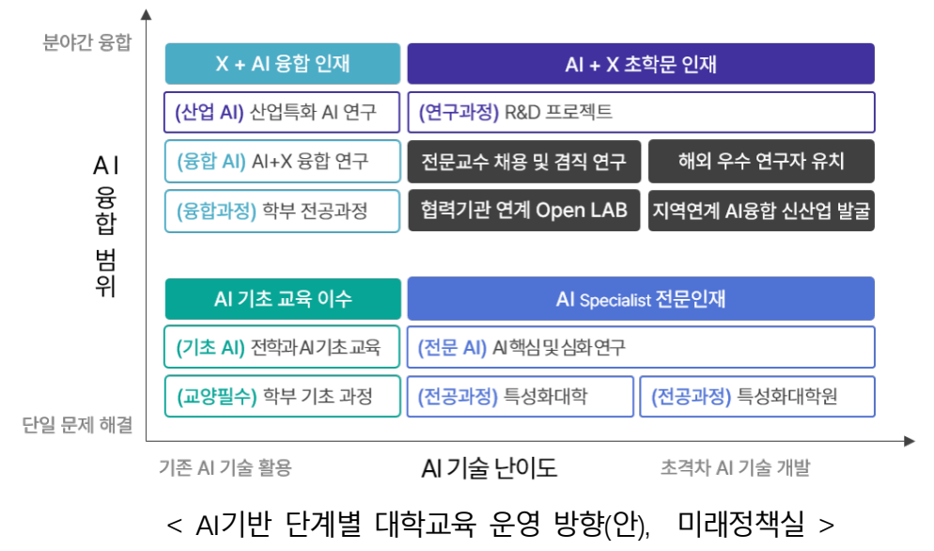
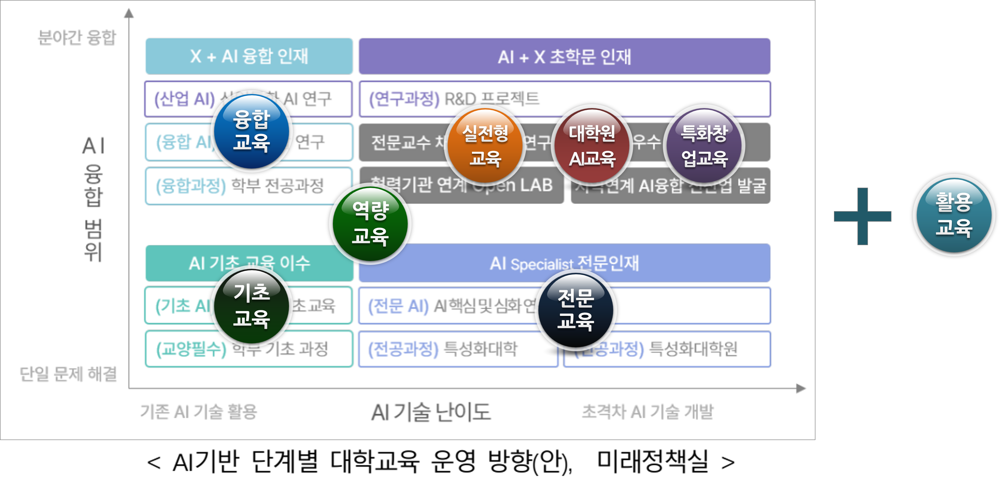
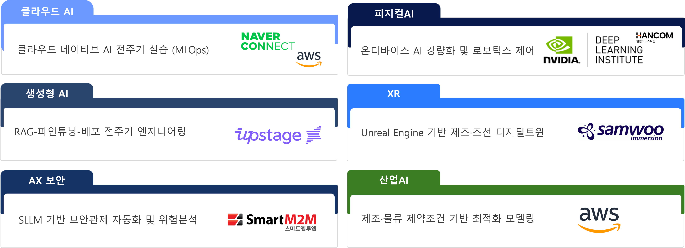
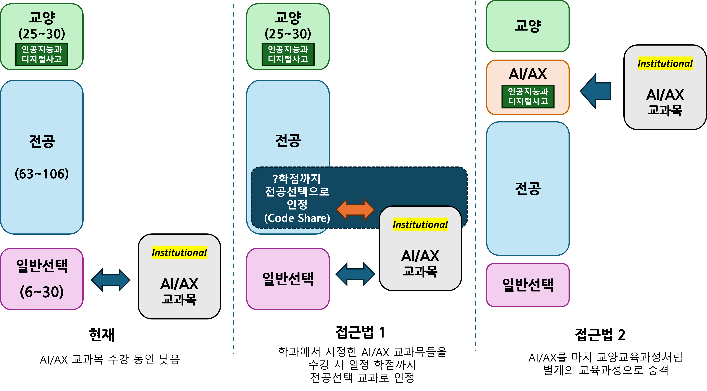

# Part II — AI 전문·융합교육과정 | ARISE PNU AI

> 원본: _source/part2.html

## 내비게이션

- [홈](index.html)
- [대학원 육성](grad.html)
- [I. 구심점 확립](part1.html)
- [II. 교육과정](part2.html) (active)
- [III. 생태계](part3.html)
- [실행 항목](actions.html)
- [📱 QR](QRCode.html)

브랜드: AI · ARISE PNU AI

## 페이지 헤더

- (breadcrumb) [ARISE PNU AI](index.html) / Part II
- (badge) PART II · ver 0.5071
- # AI 전문·융합교육과정 설계 및 운영
- 교원·교육과정·교육기반 3대 요소로 체계화한 AI 교육 전략. Teaching AI / Beyond Learning AI / Teaching with AI 분류 체계와 KPI 기반 운영 방안을 제시합니다.
- (태그 pill) 👩‍🏫 교원 · 📚 교육과정 · 🏗️ 교육기반 인프라 · ⚙️ 교육기반 조직·제도

## 사이드바 목차

- [1. 개요 및 접근법](#overview)
- [2. 교원](#faculty)
  - AI/AX 중점교원 제도
  - 외부 전문가 참여
  - 우수 교원 확보
- [3. 교육과정](#curriculum)
  - ① 개요
  - ② 교육 분류별 설계: 가. AI 기초 / 나. AI 역량 / 다. AI 전문 / 라. AI 융합 / 마. AI 실전형 / 바. 대학원 AI / 사. AI 특화 창업 / 아. AI 활용
  - ③ 학과/전공별 교육과정
- [4. 교육기반 인프라](#infra)
- [5. 교육기반 조직·제도](#org)

---

# Section 1 — 📋 개요 및 접근법

AI 전문·융합교육과정 설계 및 운영 분야 (과업 2) 교육부 지정 세부 과업과 부산대학교의 접근 방안

> 📄 AI 전문·융합교육과정 설계 및 운영 분야: [과업2 가이드라인 PDF ↗](pdf/교육부-AI거점대학-과업2-AI%20전문%20융합교육과정%20설계%20및%20운영.pdf)

교육부 4가지 세부 과업:

- 📚 **전문교육** — AI 개발자에 요구되는 역량 변화를 반영한 교육과정 재설계, 전공 과목에서 AI 윤리교육 통합 설계 추진
- 📚 **융합교육** — AI 전공자가 도메인 지식을 습득하고, 도메인 전공자는 AI를 이해·활용할 수 있는 분야별 AI 융합교과 개발
- 📚 **실젼형 교육** — 기업 현장 데이터 기반 실전 문제를 학생들이 AI를 활용하여 해결하고 기업 재직자가 멘토링하는 실전형 프로젝트 운영
- 🏗️ **교육기반** — AI 교원의 AI 교육·연구 실적 및 기여도를 반영할 수 있도록 교원업적평가 개선 및 AI 교육 기여 교원 대상 인센티브 부여

📌 접근 전략:

- ✦ 위 4가지 세부 과업을 **교원 · 교육과정 · 교육기반** 3가지 요소로 구분하여 추진 방향을 체계화
- ✦ 각 요소별로 **핵심 KPI를 정의하고 목표치를 제시**하여 제안의 신뢰도를 부각
- ✦ **준비되어 있음**(펜토미노 포함 기존 교육 혁신 작업)과 **큰 규모**(수혜·배출 학생 지표)를 강조

3대 요소:

- 👩‍🏫 **교원** — AI/AX 중점교원 제도 도입, 외부 산업계 전문가 교육 참여 확대, KPI 제시
- 📚 **교육과정** — 8개 AI/AX 교육 분류 체계, 다양한 학습 트랙, 전공·융합 교육과정 상세 설계
- 🏗️ **교육기반** — 인프라·플랫폼 구축, 교원 평가제도 개선, 조교 제도 개편, 다분반·집중수업 도입

---

# Section 2 — 👩‍🏫 교원

AI/AX 중점교원 제도 도입과 산업계 외부 전문가 교육 참여 확대를 통해 교육 역량을 강화합니다.

## ① AI/AX 중점교원 제도 도입 및 확대

💡 **AI/AX 중점교원** 제도란 AI 기술을 전공 연구·교육에 실질적으로 접목한 교원을 공식 인정하고 지원하는 체계입니다.

🎓 요건 정립 (다음 두가지 중 한가지 이상):

- **연구 기반** — 전공 분야에 AI 기술·도구를 접목하여 우수 연구 성과를 창출한 교원
- **교육 기반** — 전공 분야에 AI 기술·도구를 접목하여 교과목을 운영하여 교육 품질 향상에 기여한 교원

🎯 목표:

- ✦ AI/AX 중점교원 지정 및 현황 파악 후 목표치 제시
- ✦ **신임 교원의 50% 이상**을 AI/AX 중점교원으로 채용
- ✦ 신규 채용 수요 조사 시 AI/AX 중점교원 여부 포함

## ② 산업체·연구소 외부 AI/AX 전문가 교육 참여 확대

- 🎯 **AI/AX 멘토 (Mentor)** — 실전형 AI 프로젝트 지도. **수백 명** 확보 목표.
- 🎓 **AI/AX 교육자 (Instructor)** — AI/AX 교과 교육 직접 참여. 겸임 교원 지위 부여. **수십 명** 확보 목표.
- 🏗️ **AI/AX 설계자 (Architect)** — AI/AX 교육·연구 설계 참여. 특임 교원 지위 부여. **십수 명** 확보 목표.

## ③ 우수 교원 확보 방안 — 해외 선진 사례 벤치마킹

> AI 인재 글로벌 전쟁 — Meta 4년 3억 달러, 美 빅테크 AI 초봉 **40만 달러(약 5.5억 원)** 수준. 한국 고급 AI 인재 **약 40%** 해외 이탈(세계 최심각). 국립대 정년트랙 급여로는 산업계 대비 **1/3~1/5 수준**만 제공 가능 — 구조적 제도 혁신 필요

🌐 해외 선진 사례 벤치마킹 4대 제도 혁신 방안:

- **🔗 산학일체형 교수제 (One-Body)** [Stanford 벤치마킹]
  - 대학-기업 **공동임용 (Dual Affiliation)**
  - 「교육공무원법」 §15 · 「산업교육진흥법」 §9 근거
  - AI 거점대학 **겸직특례 제도 신설** 필요
  - 주당 20~40% 기업활동 공식 연구시간 인정
  - 기업 매칭펀드 **연 2~3천만 원** + 기술이전료 배분 최대 **50%**
- **🏥 AI 병원형 수익회계제 (AI Clinic Model)** [의대 수당 준용]
  - 산학협력단 내 **AI 산업회계(AI Clinic Account)** 신설
  - 수익 배분 — 대학운영비 **40%** / 교원성과급 **60%**
  - 산학 프로젝트·자문·기술이전 수익을 실질 보상으로 연결
  - 「산학협력단 설치·운영 규정」 개정 + 감사원 유권해석으로 법적 근거 확보
- **🚀 창업 휴직형 교수제 (AI Startup Sabbatical)** [Stanford 벤치마킹]
  - 「교육공무원법」 §44 근거 **AI 창업특별휴직제** 신설
  - 최대 **2년**(성과 시 1년 추가 연장) 허용
  - 창업성과(매출·특허·투자유치·고용창출)를 **연구실적으로 인정**
  - 기술이전료 배분 확대(최대 50%) + 수익금 개인성과급 전환
- **🛤️ 다중 트랙 제도 (Multi-Track)** [CMU 벤치마킹]
  - 정년트랙 외 **3개 트랙 병행** 신설
  - ✦ **Professor of Practice** — 산업경력 10년+ 전문가
  - ✦ **Research Faculty** — 연구전담 트랙
  - ✦ **Teaching Faculty** — 교육전담 트랙
  - 변동보상 — 기본급 **40%** + 성과급 **60%**

**🔀 공동임용 제도 강화 (Joint Appointment)** [MIT Cross-Appointment 벤치마킹]:

- AI 단과대학 ↔ 타 단과대(공대·의대·인문사회대) 교원 **공동소속** 구성
- AI 단과대가 타 학과 교원의 **인사·예산 일부 직접 관리**
- 해외 석학 초빙교수제(Visiting/Joint Professor) + 국제 공동강의
- AI 거점대학이 해외 유수 대학(MIT·Stanford·CMU)과 **공동임용 협정** 체결

## 교원 KPI

- **AI/AX 중점교원 수** — AI/AX 중점교원 수 및 비중
- **AI/AX 겸임교원 수** — 외부 AI/AX 전문가 참여 인원수

---

# Section 3 — 📚 교육과정

Teaching AI / Beyond Learning AI / Teaching with AI 세 영역, 8개 분류의 AI/AX 교육 체계를 설계합니다.

## 분류 — AI/AX 교육 분류 체계

교육과정 설계의 핵심 원칙 (5개):

- **Multi-Layered — 다층적 구조**: • 깊이 — 기초→역량→전문→고급 수직 확대 • 폭 — 전공/비전공, 학부/대학원 수평 확대
- **Connected Pathways — 연결된 트랙**: • 학생 맞춤형 진학 경로 제공 • AI 전공자·비전공자 각각의 명확한 진로 구성
- **Practical Orientation — 실전 중심**: • 산업 데이터 기반 문제 해결 • 멘토링, 프로젝트 기반 학습(PBL)
- **Scalability — 대규모 운영**: • 다분반 기반 확장형 운영 • 다양한 학생 수용 가능
- **Flexible Delivery — 유연한 학습 형식**: • Flipped Learning, Blended Learning • 집중수업, 온라인 비중 확대

8개 분류 (3개 영역):

- **TEACHING AI**
  - 가. AI 기초 교육 — Literacy
  - 나. AI 역량 교육 — Skills
  - 다. AI 전문 교육 — Engineering
  - 라. AI 융합 교육 — Convergence
  - 마. AI 실전형 교육 — Problem Solving
  - 바. 대학원 AI 교육 — Graduate
- **BEYOND LEARNING AI**
  - 사. AI 특화 창업 교육 — Venture Creation
- **TEACHING WITH AI**
  - 아. AI 활용 교육 — AI Enhanced

참고 자료 — AI 기반 대학교육 운영방안:

(이미지 src: image/AI기반대학교육운영방안.png · 캡션: 📐 AI 기반 단계별 대학교육 운영방안(안) - 미래정책실 (클릭하여 확대))

(이미지 src: image/AI기반대학교육운영방안과거점대학교육과정관계.png · 캡션: 📐 AI거점대학 교육 분류와의 관계 (클릭하여 확대))

## 트랙 — 다양한 AI/AX 학습 트랙 연결 구조

AI/AX 교육 분류는 개별적이지 않으며, 학생과 산업체의 다양한 수요를 충족할 수 있는 **트랙 구성이 가능한 연결 구조**로 설계됩니다.

AI 전공자 트랙 예시:

- AI Literacy → AI Skill → AI Engineering → Problem Solving → AI Venture
- AI Literacy → AI Skill → AI Engineering → Problem Solving → AI Research
- AI Literacy → AI Skill → AI Engineering → AI Convergence → Problem Solving → AI Research

AI 비전공자 AX 트랙 예시:

- AI Literacy → AI Skill → AI Convergence → Problem Solving → AI Venture
- AI Literacy → AI Convergence → Problem Solving → AI Research

## 가. AI 기초 교육 — Foundation of AI & Data Literacy

> **전교생 대상 필수 AI 기초 교육** — 기존 컴퓨터/SW 관련 교양 필수를 전면 개편하여 2026년부터 운영 중.
> ✦ 교과목명: **인공지능과 디지털 사고 (AI Literacy & Digital Thinking)**
> ✦ 교육과 운영의 핵심 주체: **AI융합교육원**

계열별 구성:

- 🔬 **자연/공학 계열** — 코딩 기반 과학적 문제 해결 능력 강화. 파이썬 기반 문제 해결 및 간단한 웹 구현, Copilot 활용
- 📖 **인문/사회/체육 계열** — 데이터 분석 기반 디지털 리터러시. 사회적 문제에 대한 AI 기술 고찰 + 기초 데이터 분석 실습
- 🎨 **예술 계열** — 창의적 AI 도구 활용 및 표현력 배양. 이미지 생성·작곡 등 AI 기반 창작 사례 실습

**학점 및 운영:** 3학점(3-3-0), 1학기제, Flipped Learning / 양학기 운영, 학기 별 65분반 (총 130분반) / 온라인(1h)+오프라인(2h) Blended 수업 / 학기말 Term Project

**주요 구성:** 컴퓨팅 사고력 및 파이썬 기초 코딩, 생성형 AI 도구(ChatGPT·Gemini·구글 AI Studio) 활용, Vibe Coding 기반 웹서비스 제작, AI 윤리 및 디지털 시민성 교육

## 나. AI 역량 교육 — AI Tools & Skills Training

> **AI 도구·활용 역량 강화를 원하는 AI전공 및 비전공 학생 대상 실습 중심 교육.**
> ✦ 교육과 운영의 핵심 주체: **AI융합교육원**
> ✦ 참고 - 부산대학교 2026 AI 첨단산업 인재양성 **부트캠프** [사업 선정 ↗](https://www.pusan.ac.kr/news/CMS/Board/Board.do?mCode=MN001&mode=view&board_seq=1507793&temp_data1=952&news_ho=952)
> ✦ 부트캠프형 AI역량 교육 강화, 수혜자 확대

✦ 교과 설계 주안점:

- **전공 초월형 AI 실습 교육** (Cross-Major AI Hands-on Education) — 전공 무관(Cross-Domain Accessibility), 어떤 전공이든 참여 가능한 개방형 AI 실습 체계
- **도구 중심 AI 역량 강화 교육** (Industry-Aligned, Platform-Driven) — 산업계와 공동 설계, AWS·Google·Microsoft·NVIDIA·NAVER 플랫폼 기반 운영 [외부 전문교육기관 협력]
- **다수 분반 기반 확장형 운영** (Scalable Multi-Section Delivery) — 표준화된 커리큘럼 기반 다수 분반 운영 → 대규모 학생 수용
- **플립드·혼합형 학습** (Flipped & Blended Learning) — 온라인 사전 학습 + 오프라인 실습 결합 → 학습 효율성·수강 유연성 확보
- **집중 몰입형 교육** (Immersive Block-Based Intensive Learning) — 2·4·8주 단위 집중이수제. 단기간 내 실질적 역량 습득 유도 [🏕️ 방학 중 부트캠프형 집중 교육 적극 도입]
- **수준별 단계형 교육 체계** (Level-Based Tiered Structure) — 초급–중급–고급 단계형 트랙 구성 → 학생 맞춤형 학습 경로 제공

(이미지 src: image/부트캠프_몰입형.png · 캡션: 📐 참고 자료 - 부산대 부트캠프 사업 제안서 - AI/AX 전문 업체 협력 기반 몰입형 교과목 예)

### 교과목 구성 안의 예 (확정 아님)

| 수준 | 교과목 | 설명 | 주요 도구 |
|---|---|---|---|
| 초급 | AI 프로그래밍 | Python 기반 AI 개발 기초 | Python, Jupyter, Colab, Github |
| 초급 | 데이터 분석 실습 | 데이터 처리 및 시각화 | Python, Pandas, Matplotlib |
| 중급 | LLM 활용 프로그래밍 | 생성형 AI 활용 응용 개발 능력 | Prompt Eng., RAG, LangChain, OpenAI API |
| 중급 | 로봇 AI와 시뮬레이션 | Physical AI — 제어 중심 로봇팔부터 시작 | ROS, NVIDIA Isaac, RL, VLA 기초 |
| 중급 | AI 콘텐츠와 디지털 트윈 | 창작 + 산업 융합 | Generative AI, XR (AR/VR), Digital Twin |
| 고급 | 클라우드 기반 에이전트 AI 개발 | MLOps, 멀티 에이전트, 클라우드 플랫폼 | MLOps, Multi-Agent, AWS/GCP, Azure |

## 다. AI 전문 교육 — Advanced AI Engineering Education

> **AI대학 소속 ADP 전공 학부/학과 및 대학원 교육 전문화.**
> ✦ AI 개발자에 요구되는 역량 변화 (기존 : 코드 생성 능력 → 변화 : 문제 정의 및 설계, 협업 역량, 코드 검증, 위험 관리 등)를 반영한 **교육 과정 재설계**
> ✦ 전공과목에서 **AI 윤리 교육 통합 설계** 추진
> ✦ 교육과 운영의 핵심 주체: **AI대학 소속 ADP 전공**

신규·개편 전공 차별화:

- 산업공학부 **산업AI전공** ↔ 산업공학전공 차별화
- 데이터사이언스학부 ↔ 의생명공학부 데이터사이언스전공 차별화
- AI컴퓨터공학부 **인터랙티브 컴퓨팅전공** ↔ 디자인테크놀로지전공 차별화

기존 전공 교육과정 개편:

- AI컴퓨터공학부 인공지능전공, 컴퓨터공학전공 AI 전문 교육 개편 방안
- 산업공학부 산업공학전공 AI 전문 교육 개편 방안
- 통계학과 AI 전문 교육 개편 방안

🎯 몰입형 교육체계 선도적 도입 — **AI대학 ADP 전공**에서 몰입형 교육체계를 선도적으로 도입 → **8주 단위 Half-Semester 제도** 도입 추진 (전반기 8주 + 후반기 8주)

✏️ 학부/학과별 세부 교육과정은 집필위원회 작성 결과 반영 예정 → 학과/전공별 교육과정

## 라. AI 융합 교육 — AI Convergence Education

> **AI대학 AX융합학부, 브랜드 대학 AX융합전공 등에서 운영하는 전공/도메인 특화 AI융합 교과목.**
> ✦ 예: 행정학과 "공공데이터분석론"(2025), 의류학과 "패션리테일분석"(2024), 미디어커뮤니케이션학과 "데이터기반스토리텔링"(2022) 등
> ✦ 교육과 운영의 핵심 주체: **융합전공 주관 학과 + AI융합교육원**

⚠️ 융합 교육 분야 작성시 고려 사항과 접근법:

- [융합교육센터](https://con.pusan.ac.kr/con/74187/subview.do) 기준: 19개 융합전공, 10개 연계전공, 35개 마이크로디그리, 21개 트랙 운영 중이며 다수가 AX융합 분류 가능
- 전공·교육과정은 있으나 참여 학생이 거의 없거나 교과목을 개설하지 않는 경우도 다수 → 행정 부하 가중
- 전공+AI융합 신규 교과목 개발을 위한 참여학과 참여율 저조 → 참여를 유도할 추가 유인책 마련 필요
- **AI융합교육원 주도의 계열별 융합교과목** 적극 개발 → 여전히 도메인 전문가와 관련 데이터 확보 필요
- 무분별한 신설 보다는 AI/AX 관련 **기존 융합전공을 재편**하고 가능하면 **AX융합학부로 소속 변경** 검토
- 이공계 분야 융합 교과목 발굴 및 **X-Mobility 분야 융합 교육** 특화 부각

✏️ 융합교육과정별 세부 교육과정은 집필위원회 작성 결과 반영 예정 → 학과/전공별 교육과정

## 마. AI 실전형 교육 — Real-World AI Problem-Solving (with Industry Data)

> 가칭 **AX-PBL** 교과목
> ✦ 산업 데이터 기반 AI 문제해결 프로젝트 I & II. 최대 6학점.
> ✦ 개별 학과의 전공필수형 캡스톤디자인 교과목을 AX-PBL로 대체 가능하도록 제도 개편
> ✦ 교육과 운영의 핵심 주체: **장영실AI융합연구원 / AI융합교육원 + 개별 대학원 학과 및 BK21 사업단과 협력**

(이미지 src: image/AX-PBL.jpg · 캡션: 📐 AX-PBL 교과목 구조 - 실전형 교과 교육)

참여자 구성 (URP 연계):

- AI/AX 학부 연구생
- 교수, 대학원생
- 산업체 재직자 및 전문가

복합 목적:

- 교육 + 연구개발 + 지역·산학 협력의 복합체
- 동남권 수요 기반 주제 발굴
- **성장엔진 분야 프로젝트는 X-모빌리티 대학에서 별도 관리**

## 바. 대학원 AI 교육 — Graduate Level AI Education

### A. 대학원 공통 핵심 교육

✦ 모든 대학원 전공에서 활용 가능하도록 교과목 설계
✦ 대형 강의·다수 분반 확장형 운영
✦ 교육과 운영의 핵심 주체: **장영실AI융합연구원**

핵심 교과목:

- 🌟 Research Methods with AI
- 🌟 Advanced Data Analytics
- 🌟 AI for Scientific Discovery

**기대효과:** AI 활용 연구 생산성 개선, 책임 시수 경감에 따른 대학원 전공 강의 축소(?)에 대응
📊 학기별 강좌 수 변화: [학기별_개설강좌수.html ↗](학기별_개설강좌수.html)

### B. 주권형 AI 컴퓨팅·시스템 교육

✦ **Sovereign AI** 개념 기반 특화 교육 프로그램 개발
✦ 핵심 주체: **ADP 대학원 + 장영실AI융합연구원 연계**

- ⚙️ **모델** — 국내 생성형 AI 모델 개발·활용 생태계 기여 방향 교육 / Physical AI 한국형 VLA 및 World Model 개발·활용 생태계 기여
- ⚙️ **데이터** — 성장엔진을 포함 국가 전략 산업·기반 시스템 분야의 데이터 보안 및 Ontology/Context 구축을 위한 관련 이론, 도구, 기술 교육
- ⚙️ **시스템** — 국산 AI 반도체·로봇 기반 AI 시스템 개발·활용 생태계 기여 방향 교육
- ✦ 서울대·과기원 등 우수 대학원과 협력·공동 교육 체계 구축
- ✦ 장영실AI융합연구원 Top-Down형 전략 연구와 연계

## 사. AI 특화 창업 교육 — AI Venture Creation Education [Beyond Learning AI]

🏆 창업 역량 — 창업중심대학 기관 평가 최우수 — 부산대학교는 창업중심대학 기관 평가에서 **"최우수"**를 획득하여 창업 교육·지원 역량을 검증받았습니다. [관련 보도 ↗](https://n.news.naver.com/article/025/0003519581?sid=102)

실전형 AI 기술 창업 특화 교육:

- AI/AX 기술 창업가의 교육 참여 및 멘토링 지원
- 자체 AI 인프라 활용 지원
- AI API 크레딧 및 바우처 제도 운영

핵심 주체: [창업지원단 ↗](https://bi.pusan.ac.kr/) — 장영실AI융합연구원 연계하여 AI/AX 실전 문제해결 역량 기반 창업 생태계 구축

## 아. AI 활용 교육 — AI Enhanced Education [Teaching with AI]

> ✦ **AI를 교육의 대상이 아닌 도구로 활용**하여 기존 교과의 학습 효과·교수 효율성·학습 경험을 혁신합니다.
> ✦ 교육과 운영의 핵심 주체: **교양교육원, AI융합교육원, 에듀테크센터**

- 🎯 **학습 개인화** — Personalized Learning — AI 기반 개인 맞춤 학습 경로 및 피드백 제공
- ⚡ **학습 효율 향상** — Learning Efficiency — Flipped Learning으로 오프라인 시간 심화 활용
- 📈 **교수 생산성 증대** — Instructor Productivity — 표준화 콘텐츠로 다중 분반 운영 최적화
- ✨ **학습 경험 혁신** — Enhanced Learning Experience — Labster·PhET 등 최신 AI 도구 활용

우선 적용 후보 교과목:

- 일반물리학개론/실험
- 공학미적분학
- 공학선형대수학
- 고전읽기와 토론
- 열린사고와표현
- 공학작문 및 발표

📊 우리 대학 개설 강좌 현황: [종합분석_개설강좌.html ↗](종합분석_개설강좌.html)

💡 관련 사례: AI 코스웨어(구 효원 브릿지) — 자연·공학 계열 수학·물리·화학 AI 코스웨어 우선 개발

5가지 실행 모델:

1. **중앙 주도형 콘텐츠 개발** — Individual → Institutional 전환, 규모의 경제 확보
2. **Flipped & Blended Learning** — "인공지능과 디지털 사고", "대학영어"에서 이미 적용 중인 모델
3. **AI 기반 콘텐츠 개발** — LLM·자동 문제 생성·영상 생성 도구 + Labster·PhET 활용
4. **경쟁 구조 (Competitive Model)** — 복수 콘텐츠 개발팀 지정, 학생 선택권 확대, 품질 향상
5. **평가·공개 기반 환류 체계** — 강의 평가·성과 데이터 공개, 우수 콘텐츠 지속 확산

## ③ 학과/전공별 교육과정 — AI대학 소속 학부/학과별 세부 교육과정

✏️ 이 섹션은 집필위원회 작성 결과를 바탕으로 추후 기입 예정입니다.

- 🤖 **AI컴퓨터공학부** — 인공지능전공 / 컴퓨터공학전공 / 인터랙티브컴퓨팅전공 (✏️ 세부 교육과정 작성 예정)
- 📊 **데이터사이언스학부** — 데이터사이언스전공 (✏️ 세부 교육과정 작성 예정)
- ⚙️ **산업공학부** — 산업공학전공 / 산업AI전공 (✏️ 세부 교육과정 작성 예정)
- 📈 **통계학과** — 통계학과 AI 전문 교육과정 (✏️ 세부 교육과정 작성 예정)
- 🔗 **AX융합학부** — 9개 분야 18개 AX 융합전공 (지역 성장엔진 분야 포함) (✏️ 융합전공별 세부 교육과정 작성 예정)

## 교육과정 KPI

🎯 교육부 문건 기준: **"연 1,500명 내외"** 성과 목표치 제시 (배출 인원 기준, 교당 500명 예상). 가능한 많은 학생이 수혜·배출되도록 극대화 추진.

(이미지 src: image/SW중심대학 성과지표1.jpg · 캡션: 참고: SW중심대학 성과지표 1 (클릭하여 확대))

(이미지 src: image/SW중심대학 성과지표2.jpg · 캡션: 참고: SW중심대학 성과지표 2 (클릭하여 확대))

## Implementation — 융합교육 실현의 어려움

> ⚠️ 다양한 AI/SW 융합교육과정을 설계하였으나 실제 참여율은 저조
> ✦ 참여 학과/교수의 융합전공 교과 개발 참여율 저조
> ✦ 학생의 융합전공 선택 동기 높지 않음 : 직접적 인센티브의 부재
> ✦ 융합형 교과목 이수의 어려움 : 전공 불인정 + 수강의 어려움 (수강 인원이 적어 단일 또는 소수 분반, 수업 시간표 문제)
> 🎯 AI융합교육원 주도의 융합교과목 개발 + 학생 수강 동인을 높이고 이수를 쉽게하는 방안 모색

(이미지 src: image/AX교과이수구조와활성화방안.png · 캡션: 📐 AI융합 교육 활성화를 위한 AI/AX 교과 분류 검토)

---

# Section 4 — 🖥️ 교육기반 — 인프라·플랫폼

AI/AX 교육연구에 필요한 GPU 인프라, 클라우드 플랫폼, 실습 환경 구축 계획

> 🔗 인프라 상세 계획은 [Part I. Section 5 — AI 인프라 확충·집적화 ↗](part1.html#infra)를 참조하세요.

---

# Section 5 — ⚙️ 교육기반 — 조직·제도·프로그램

AI/AX 교육 활성화를 위한 교원 평가 제도 개선, 인센티브, 수업 운영 혁신 방안

## ① 교원 업적평가 제도 개선

> ✦ 교육 영역에 AI/AX 교육 실적 기여도 항목 신설.
> 📌 Top-Tier AI Conference 임용·승진 실적 인정

📋 업적평가 신설 항목 (AI/AX 교육 기여도):

- **AI 융합교과목 개발·운영** — 전공 특화 AI 융합교과 신설·운영 실적
- **융합교과목 팀 강의 운영** — AI 전공-비전공 교원 공동 팀티칭 실적
- **AI 융합교과목 개발 우수사례 수상** — 교내외 교육 혁신상 수상 가점
- **타 전공 교원 대상 AI 교육** — CTL 기반 AI 연수 강사 활동 인정
- **Top-Tier AI 컨퍼런스 논문실적** — 임용·승진 시 SCI 저널 동급 이상 인정

Top-Tier AI 학회 (인정 범위):

- **Machine Learning (Core AI) — 최상위 3대 학회**: NeurIPS · ICML · ICLR — BK21에서 SCI 상위 저널과 동급 이상 취급
- **Computer Vision**: CVPR · ICCV · ECCV — 산업 영향력 매우 큼 (자율주행, 제조, 의료 영상)
- **NLP — LLM 시대 이후 중요도 급상승**: ACL · EMNLP · NAACL
- **그 외 Top-Tier / 상위 A급**: AAAI · KDD · WWW (The Web Conference) · IJCAI

## ② AI/AX 교육 기여 교원 인센티브

> 대형 강의 운영 시 수강생 수에 비례한 **조교 등 강의보조인력 지원** 및 수당 지급으로 교원의 교육 참여 부담 경감

### A. 📌 조교 제도 개편

현황: 학기 당 1,100여 명, 18억 5천만원 규모 조교비 지출 / 🎯 장학조교+연구조교 → 수업조교+연구조교

- **수업조교** — ✦ 수업에 직접 기여. 매칭 수업 필요 ✦ 역할 수준에 따라 조교비 차등 지급.
- **연구조교** — ✦ AI/AX 교육 활성 기여 교수 포함 우수 교수의 연구활동 보조 ✦ 교수 **인센티브**로 활용.

📌 배정 방식 변경 — 학과·기관 단위 배정 → 본부 관련 기관에서 수요(→수업조교)·성과(→연구조교) 기반 직접 배정·관리

### B. 다분반 강의·집중수업 활성화 (교원 연구 몰입 시간 확보)

집중수업 방식:

- **8주 Block Course (학기 중)** — 전반기(8주)+후반기(8주)
- **2~4주 Boot Camp (방학)** — 단기 집중 이수

교원 혜택:

- 다분반 기여 교원 → 인정 책임 시수 확대
- 학기 중 **1~2개월, 최대 1학기**까지 연구 몰입 가능

## ③ 비전공 교원 AI 기본·심화 연수 체계 (CTL)

> 비전공 교원이 전공 특화 AI 융합교과를 **직접 개발·강의**할 수 있도록 교수학습센터(CTL) 중심의 단계별 AI 연수 운영

- 🎓 **기본 연수 (AI Literacy for Faculty)**: ✦ AI 개념·도구 기초 이해 ✦ 교과 활용 사례 기반 실습 ✦ AI 윤리·저작권 교육 ✦ 대상: AI 비전공 전체 교원
- 🔬 **심화 연수 (AI Integration for Faculty)**: ✦ 전공 특화 AI 융합교과 설계·개발 ✦ AI 전공 교원과 공동 개발 워크숍 ✦ 우수 사례 공유 및 교과목 인증 ✦ 대상: 기본 연수 이수 교원 중 희망자

**점검 체계** — 연수 이수율·교과 개발 실적·학생 만족도를 정기 점검하여 연수 프로그램 환류에 반영

## ④ 교육과정위원회 운영 및 AI 역량 측정 환류체계

🏛️ 산업계 전문가 참여 교육과정위원회:

> **산업계 전문가가 정기적으로 참여**하는 교육과정위원회를 통해 현장 수요를 반영한 교육과정 지속 개선

- ✦ AI/AX 교육자·설계자(Instructor/Architect) 포함
- ✦ 분야별 산업 전문가 · 정부·연구소 인사 참여
- ✦ 연 2회 이상 정기 개최 + 수시 자문

📊 학생 AI 역량 측정 및 환류:

> **AI 거점대학 공동 개발**한 역량 측정 도구로 학생 AI 역량을 측정하고, 결과를 교육 프로그램에 환류

> ⚠️ 추출 주: 원본 HTML이 이 지점(④ 교육과정위원회·환류체계의 마지막 kp-box)에서 중간에 잘려 있음 — 섹션/블록 닫는 태그 없이 곧바로 이미지 라이트박스 마크업으로 이어집니다. 추가 본문이 있었다면 원본에 존재하지 않아 추출할 수 없습니다. (footer 요소 역시 원본에 누락되어 있습니다.)

## 미디어·링크 목록

이미지:

-  (src: image/AI기반대학교육운영방안.png)
-  (src: image/AI기반대학교육운영방안과거점대학교육과정관계.png)
-  (src: image/부트캠프_몰입형.png)
-  (src: image/AX-PBL.jpg)
-  (src: image/SW중심대학 성과지표1.jpg)
-  (src: image/SW중심대학 성과지표2.jpg)
-  (src: image/AX교과이수구조와활성화방안.png)

다운로드 파일 (PDF):

- pdf/교육부-AI거점대학-과업2-AI 전문 융합교육과정 설계 및 운영.pdf (과업2 가이드라인)

내부 페이지 링크:

- [index.html](index.html)
- [grad.html](grad.html)
- [part1.html](part1.html) · [part1.html#infra](part1.html#infra) (Part I Section 5 인프라)
- [part2.html](part2.html)
- [part3.html](part3.html)
- [actions.html](actions.html)
- [QRCode.html](QRCode.html)
- [학기별_개설강좌수.html](학기별_개설강좌수.html)
- [종합분석_개설강좌.html](종합분석_개설강좌.html)

외부 URL:

- https://www.pusan.ac.kr/news/CMS/Board/Board.do?mCode=MN001&mode=view&board_seq=1507793&temp_data1=952&news_ho=952 (부트캠프 사업 선정)
- https://con.pusan.ac.kr/con/74187/subview.do (융합교육센터)
- https://n.news.naver.com/article/025/0003519581?sid=102 (창업중심대학 최우수 관련 보도)
- https://bi.pusan.ac.kr/ (창업지원단)
