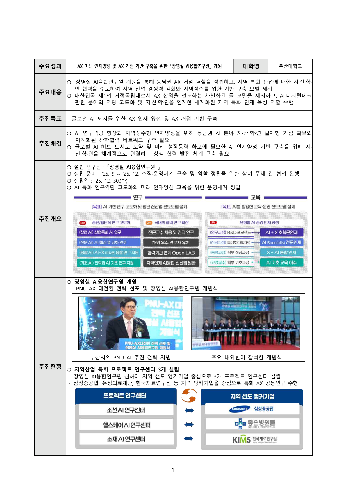
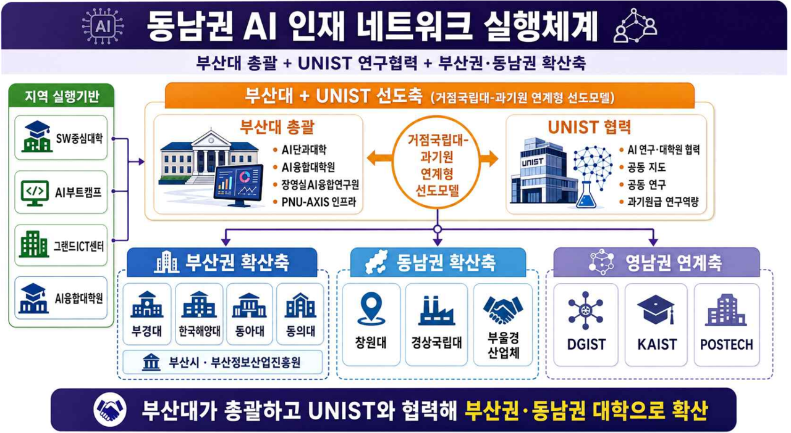

# Part III — 지역 AX 교육·연구 생태계 조성 | ARISE PNU AI

> 원본: _source/part3.html

## 내비게이션

- [홈](index.html)
- [대학원 육성](grad.html)
- [I. 구심점 확립](part1.html)
- [II. 교육과정](part2.html)
- [III. 생태계](part3.html) (active)
- [실행 항목](actions.html)
- [📱 QR](QRCode.html)

브랜드: AI · ARISE PNU AI

## 페이지 헤더

- (breadcrumb) [ARISE PNU AI](index.html) / Part III
- (badge) PART III · ver 0.5071
- # 🌐 지역 AX 교육·연구 생태계 조성
- 지역 기업 참여 산학 공동 AX 연구, 지역 대학 간 AI 인재 네트워크 구축, 초·중·고·평생학습 연계를 통해 동남권 AI 생태계의 실질적 허브로 자리합니다.
- (태그 pill) 📋 개요 · 🔬 지역 AX 연구 · 🤝 지역 AI 인재 네트워크 · 🔄 교육-연구-평생학습 연계

## 사이드바 목차

- [1. 개요 및 접근법](#overview)
- [2. 지역 AX 연구](#research)
  - 산학연 공동 AX 연구 센터
  - 산학 연계 인재 양성 제도
  - 학부생 연구 프로그램(URP)
- [3. 동남권 AI 인재 네트워크](#network)
  - 거점대/과기원 선도 운영 체계
  - 3대 핵심 전략
- [4. 교육-연구-평생학습 연계](#lifelong)
  - 생애주기 AI 교육 파이프라인
  - 이원+통합 거버넌스 & 협력체계
  - 평생학습 AI 교육

---

# Section 1 — 📋 개요 및 접근법

지역 AX 교육·연구 생태계 조성 분야 (과업 3) 교육부 지정 세부 과업과 부산대학교의 접근 방안

> 📄 지역 AX 교육·연구 생태계 조성 분야: [과업3 가이드라인 PDF ↗](pdf/교육부-AI거점대학-과업3-지역%20AX%20교육연구%20생태계%20조성.pdf)

3대 과업:

- 🔬 **지역 AX 연구** — 지역 기업 참여 산학 공동 AX 연구 추진 — 산학 공동 AX 연구센터 구성·운영, 학생 참여형 연구 프로그램(URP), 대학원 패스트트랙
- 🤝 **지역 AI 인재 네트워크** — 거점대학 중심의 지역 AI 인재 공급 생태계 구축 — 거점대-과기원 협의체, AI 중심대 연계, 재직자 AI 전환 교육 지원
- 🔄 **교육-연구-평생학습 연계** — 초·중·고·평생학습과의 AI 교육 연계 확산 — 고교학점제 연계, 재직자 교육, K-MOOC 확대

📌 접근 전략:

- ✦ 장영실AI융합연구원·PNU-IDC·부트캠프 운영 등 **이미 준비된** 산학협력 인프라를 기반으로 제안
- ✦ **동남권 AI 생태계 허브**로서 부·울·경 지역 대학·기업·지자체를 하나의 네트워크로 연결
- ✦ 지역 전략산업(조선·의료·해양·제조)과의 **도메인 특화 AX 연구**로 차별화된 생태계 조성

---

# Section 2 — 🔬 지역 AX 연구

장영실AI융합연구원 중심의 산학연 공동 AX 연구체계 — 지역 성장엔진 특화 연구·산학 연계 인재 양성·학부생 연구 프로그램(URP) 통합 운영

## 2.1 산학연 공동 AX 연구 센터 — 장영실AI융합연구원

> **'산학 공동 AX 연구센터'**의 부산대 실행체이자 컨트롤 타워 **장영실AI융합연구원**
> 앵커기업 중심 AI+X 산학연 협력체계로 지역 특화산업 AX 전환 거점 구축

🏛️ 설립 개요:

- 설립일: 2025년 12월 30일
- 설립 목표: 동남권 지·산·학·연 일체형 거점. AX 미래 인재양성 및 AX 거점 기반 구축
- 운영 구조: 앵커기업 중심 프로젝트 연구센터 → 협력기업 확산 → 취업·정주 연계
- 연계 자원: AI융합대학원 석·박사생 R&D + PNU-AXIS GPU + DS전문대학원

✅ 이미 구축된 협력 성과:

- 조선 특화 교과목 5개 개설
- 취업역량 강화 세미나·컨퍼런스 4회
- 협력기업 재직자 AX 교육 2회
- AI 솔루션 과제 발굴 협의 3회
- RISE 산학공동연구 과제 추진 중

(이미지 src: image/장영실연구원_p01.png · 캡션: 📐 장영실AI융합연구원 개원 성과 (클릭하여 확대))

(이미지 src: image/장영실연구원_p02.png · 캡션: 📐 산학연 협력 실적 및 기대효과 (클릭하여 확대))

🏭 프로젝트 연구센터 3개 (앵커기업 중심):

- 🚢 **조선·구조 AI센터** — **삼성중공업** 앵커. AI 구조 최적화 알고리즘 개발. 조선 특화 교과목 5개·취업 연계 세미나 4회·협력기업 재직자 교육 2회
- 🏥 **헬스케어 AI센터** — **은성의료재단** 앵커. AI 솔루션 과제 발굴 협의 3회. 헬스케어 AX 특화 과제 기반 확보 (양산캠퍼스 연계)
- 🧪 **소재·재료 AI센터** — **한국재료연구원** 앵커. RISE 산학공동연구 과제 추진. 소재 분야 AX 특화 과제 발굴

🔭 전략 특화 연구센터 확장 계획:

- 🧠 **PNU AI Context Center** — **Sovereign AI** 관점 Ontology/Context 연구 — 조선·항만물류·해양수산·국방 분야. Computing·LLM은 해외 기반 활용 불가피하나 Context/Ontology는 국가·산업 안보상 자체 구축 필요. 공공기관·연구소와 연계한 **B2G 과제** 발굴 지향
- 📐 **PNU AI E&E Center** — **Education & Ethics** 분야 연구 전담. AI 교육 콘텐츠 연구·개발 — EduTech 기업·교육청 연계. Section 4 교육-연구-평생학습 연계 부분과 통합 운영. AI 윤리·신뢰 모듈 개발 및 권역 표준화

### 다양성 — 의료/의생명과 금융 인공지능 융합연구센터 필요성

> ⚠️ 산업부/교육부가 **지역 성장엔진** 산업으로 지정하지 않았더라도 지역과 학생 수요를 고려할 때 중요한 분야
> ✦ 의학, 의생명 분야 인공지능 융합 연구센터 - 양산캠퍼스와 연계
> ✦ 금융과 인공지능 융합, 핀테크 연구센터 - 문현 금융단지
> 🎯 장영실AI융합연구원 산하에 구축하기 힘들더라도 함께 언급하는 것이 제안 완성도 관점에서 바람직

## 2.2 산학 연계 인재 양성 제도

> 대학원생을 **연구 → 인턴십 → 취업 → 지역 정주**로 이어지는 선순환 구조에 편입. 산학 공동 지도교수제·대학원생 교류 인턴십·AX 프로젝트 석사를 패키지로 운영

- 🏫 **산학 공동 지도교수제** — 대학 교수 + 앵커기업 연구책임자 공동 지도. 산업 수요 기반 연구 주제 발굴 → 학위 취득 지원. 현장 문제를 논문 주제로 직결
- 🏭 **대학원생 교류 인턴십** — 앵커기업·협력기업 현장 인턴십 (학기·하계·동계). 삼성중공업 취업 연계 트랙 운영 중. 인턴십 → 취업 → 지역 정주 선순환
- 🎓 **AX 프로젝트 석사** — AX 연구 프로젝트 성과물로 **석사학위 취득 지원**. 프로젝트 연구센터 산하 자기주도 연구 과제 연계. 산업 석사·일반 석사 병행
- 🚀 **패스트트랙 연계 패키지** — **학·석사/학·석·박 패스트트랙** + 우수인재 장학금 + 연구장려금 + 글로벌 공동 연구 프로그램. 26.2월 고등교육법 개정 기반

## 2.3 학부생 연구 프로그램(URP) & 지역 AX 프로젝트 수행

> 🌟 우리의 핵심 AX 인재 양성 방안인 **PNU 1000 AX 인재 양성 프로그램**과 지역 AX 프로젝트는 바로 맞닿아 있음
> 🎯 "PNU 1000 AX"를 즉각적으로 실행하려면 사업 제안 단계에서 이미 수요가 되는 AX 프로젝트 목록 상당수 구축 필요
> 📌 **과제 수행 의지와 진정성을 보이는 증거**로 활용
> ⚙️ AX-PBL 과제 수요를 **Bottom-Up** 방식으로 획득하기 위한 시스템 구축 필요
> 🖥️ AX-PBL 과제 취합, 학석연계 프로그램 신청자 정보 수집 등을 위한 **AI-Enabled Pilot System** (정식 시스템 구축 전에, 생성형 AI로 빠르게 만들어 쓰는 실험적·임시 시스템)을 조속히 구축하고 정보를 취합

### 🚀 PNU 1000 AX 인재 양성 프로그램 (Top-Down 핵심 프로그램)

(이미지 src: ./image/AX-PBL.jpg · alt: PNU AX 1000 프로그램 개념도)

- **대상** — 학부 3·4학년 중 대학원 진학 의지가 있는 최대 1,000명을 학부연구생으로 지원 (3학년 2학기·4학년 1·2학기 각 300여명)
- **지원 규모** — 1인당 월 25만원 / 학기 150만원 / 연 300만원, 최대 연 30억원 특별 장학금 지원
- **운영 방식** — 연구소·대학원·학부·산업체 연계 URP/패스트트랙 AX 전문 인재 양성. 학부생 1,000명 + 대학원생·기업체·연구원·교수 등 수천 명이 동남권 AX 프로젝트를 공동 수행하는 생태계형 프로그램
- ✦ 진로를 고민하는 3·4학년 수천 명이 직접 수혜·참여하는 학생 체감도가 높은 프로그램

🔬 AX-PBL과 AX 프로젝트:

- **🚀 PNU 1000 AX 인재 양성 프로그램**의 기초인 AX 프로젝트 기반 AX-PBL
- ✦ 지역 수요에 기반한 **수백개의 Bottom-Up** AX 프로젝트
- ✦ AI Context Center, AI E&E Center 등을 통해 전략적으로 추진할 **수개의 장기 Top-Down** AX 프로젝트
- ✦ AX-PBL을 학기·하계·동계 3트랙 운영
- ✦ AX 프로젝트 우수 성과자 → 글로벌 공동 연구 프로그램 연계

🌐 지역 대학 개방 URP:

- 부산권 — 부경대·한국해양대·동아대·동의대 등
- 동남권 — 창원대·경상국립대 등
- 장영실연구원-지역 대학 **협약 기반** 운영
- 하계·동계 집중 프로그램 + 온라인 병행
- **지역 AI 인재 네트워크(Section 3)**와 연동

📊 5년 KPI 목표치 (예):

- 🏭 프로젝트 연구센터: **8개** (3개→8개)
- 👩‍🏫 산학 공동 지도교수: **30명**
- 🎓 AX 프로젝트 석사 배출: **80명**
- 🔬 지역 수요 바탕으로 수행한 AX 프로젝트: **350개**

---

# Section 3 — 🤝 지역 AI 인재 네트워크

부산대-UNIST 공동 선도체계를 중심으로 동남권 대학·산업체·지자체를 하나의 AI 인재 혁신 운영 협의체로 연결하는 거점 플랫폼 구축 전략

> 📄 상세 운영 방안: [지역 AI 인재 네트워크 구축 방안 ↗](pdf/부산대_지역AI인재네트워크구축방안_백윤주.pdf)

## 3.1 거점대-과기원 선도 운영체계

> 부산대가 단순 **'AI 단과대학 보유'**에 그치지 않고, **UNIST와 협력해 동남권 대학 전체에 실질적 리더십을 발휘하는 주관기관**으로 강력히 포지셔닝 — 학점교류·교원 겸직·공동 R&D·GPU 공동활용까지 포괄하는 **(가칭) 동남권 AI 인재 혁신 운영 협의체** 출범

(이미지 src: image/지역AI인재네트워크구축방향.png · 캡션: 📐 지역 AI 인재 네트워크 구축 방향)

🏆 부산대 주관기관 7대 우위 (페이지에는 6개 카드 표기):

- 🏛️ **AI 단과대학 신설** — 2026년 3월 신설 추진. 학사조직 기반으로 협의체 운영 즉시 실행 가능
- 🔗 **탄탄한 협력 네트워크** — 과기정통부 AI융합대학원 운영 중. **129개** 협력기관 네트워크 보유
- ⏳ **SW중심대학 10년** — 동남권 가장 검증된 SW·AI 교육사업 운영 경험. 10년 연속 수행
- 🔬 **거점대-과기원 연계** — UNIST와 직접 협력 가능한 지리적·정책적 여건. 거점국립대-과기원 연계형 선도모델 제시
- 🏙️ **실무 채널 보유** — 부산시·부산정보산업진흥원 및 부산권 대학 협의 채널. 월례 학장급 협의체 운영 중
- ↕️ **수직·수평 통합** — DS전문대학원·장영실연구원·PNU-AXIS 수직 통합 + UNIST·창원대·경상국립대 수평 확장

🏗️ 선도 운영체계 구성 — (가칭) 동남권 AI 인재 혁신 운영 협의체:

- 🔷 **1차 선도축 — 부산대 + UNIST**
  - **AI단과대학** — 학사·교과·학점교류 최종 조정
  - **장영실AI융합연구원** — 협의체 운영·공동 R&D·글로벌 채널
  - **AI융합교육원** — 공통 교과·마이크로디그리·AI 윤리 모듈
  - **UNIST** — 과기원급 AI 연구·대학원 협력축
- 🔶 **단계적 확산 구조**
  - **부산권** — 부경대·한국해양대·동아대·동의대
  - **동남권** — 창원대·경상국립대 등 부울경 대학
  - **영남권** — DGIST·POSTECH·KAIST 연계
  - **실행기반** — 부산시·부산정보산업진흥원·SW중심대학·AI부트캠프·그랜드ICT

(이미지 src: image/지역AI인재네트워크실행체계.png · 캡션: 📐 동남권 AI 인재 네트워크 실행 체계)

## 3.2 핵심 전략 3개 — 교육·연구·인프라 통합

(이미지 src: image/지역AI인재네트워크실행방안.png · 캡션: 📐 동남권 AI 인재 네트워크 핵심 전략 및 실행 방안)

- **전략 1 — 거점대-과기원 협력 고도화 (교육 및 인적 교류)**
  - 협력체계: 부산대(총괄) + UNIST(연구/대학원 협력축) 선도 운영체계 구성, 동남권 대학 단계적 연결
  - 자원·교과 공유: KNU10 + UNIST LMS 통합 연계, 공통 마이크로디그리·AI 윤리 모듈 즉시 가동
  - 인적 결합: 교원 이중 소속(교육공무원법 §15 겸직특례)·산업체 공동임용·공동 지도교수제·패스트트랙(26.2월 고등교육법 개정 기반)
  - 고도화: 공동 학위/복수학위·차기 AI융합대학원 공동 기획·공동 교원 인사위원회 운영 검토
- **전략 2 — AI 중심대·AX 대학원 사업 연계 (연구 및 산업 연계)**
  - 사업 성과 공유: SW중심대학·AI부트캠프·그랜드ICT·AI융합대학원 등 기존 사업을 선도모델과 연결. 우수/실패 사례 공개로 현장성 강화
  - 공동 연구·산업 연계: 동남권 전략산업(조선·모빌리티·항만·에너지·의료) AI+X 프로젝트, 기업 데이터 기반 PBL, 공동 R&D 데모데이 **연 2회** 개최
- **전략 3 — 4계층 자원 공유 및 확산 (인프라)**
  - 🖥️ 컴퓨팅: PNU-AXIS GPU 시간을 동남권 컨소시엄 · UNIST 우선 배정
  - 📦 데이터: 산업 도메인 데이터셋 (조선·모빌리티 등) 공동 활용
  - 🤖 모델: 도메인 특화 LLM · AI Agent — AI융합대학원·AX 융합학부 공동 개발
  - 📚 교과: K-MOOC 부산대 AI 채널 · AI 윤리 모듈 → 권역 공통 자원 확산

## 3.2 (중복 번호) 동남권 AI 인재 혁신 — 5년 추진 목표 & KPI

> **5개 추진 목표**: 선도형 교육모델 확산 · 실질적 학사 공유 · 강력한 인적 결합 · 4대 자원 공동활용(GPU·데이터·모델·K-MOOC) · 지역 산업 AX 견인

📊 5년 사업 주요 KPI (예):

- 🎓 **교육·학사 공유**: 학점교류 1,000명 · 공동교과 30과목 · 마이크로디그리 표준 8개 · 이수자 500명 · AI 윤리·신뢰 모듈 8개 · 협의체 9개교 100% 채택
- 👥 **인적 결합**: 겸직 교원 20명 · 공동임용 10명 · 공동 지도 100명 · 패스트트랙 진학 75명
- 🔬 **공동 R&D**: 공동 연구단 3개 · 누적 과제 50건 · 글로벌(EU·NSF) 3건
- 🖥️ **인프라 공동활용**: 외부 개방 50만 GPU·h · 참여 기관 8개 · 산업 데이터셋 25종 · 도메인 특화 LLM 3종

---

# Section 4 — 🔄 교육-연구-평생학습 연계

학부 교육·대학원 연구·산업 현장·평생학습을 하나의 순환 생태계로 연결하는 통합 연계 체계

> 📄 상세 운영 방안: [교육-연구-평생학습 연계 방안 (AI융합교육원) ↗](pdf/부산대_교육연구평생연계방안_융합교육원.pdf)

## 4.1 생애주기 AI 교육 파이프라인 구축

> 초·중·고 → 대학(전교생 AI 기본) → 교원 → 재직자 학위·비학위 → 시민·취약계층까지 **부산대 단일 운영체계** 안에서 단계 간 콘텐츠·이수 이력이 연결되는 **생애주기 AI 교육 파이프라인** 구축

(이미지 src: image/생애주기AI파이프라인.png · 캡션: 📐 생애주기 AI 교육 파이프라인 & 추진 개요)

🏆 부산대의 리더십 — 이미 검증된 운영체계:

- 🏛️ **SW중심대학 10년** — 동남권 최초·10년 연속. 전교생 AI 기본교육 이수율 99.13%·322분반 (2025년 기준)
- 🎓 **AI융합교육원** — 총장 직속 5부서 운영. **가치확산부**가 재직자·시민 AI 평생교육 연계 주관
- 🌐 **K-MOOC 무크선도대학** — 8년·29강좌·2023 선정. 매년 4개 이상 AI 특성화 강좌 운영
- 👩‍🏫 **사범대 AI융합교육전공** — 현직교원 대학원 트랙 기설치. 정부 「AI 교사 1만명」 동남권 위탁 거점 가능
- 🖥️ **PNU-AXIS + AI코딩존** — GPU 인프라·AI 실습 크레딧·code.pusan.ac.kr 코딩역량시스템·PLATO LMS
- 🏭 **재직자 네트워크** — ICT융합학과 10년 실적 (재직자 149명·63개 기업). 동남권AI혁신연구센터 착수 ('26.07~)

(이미지 src: image/생애주기AI부산대자산.png · 캡션: 📐 부산대 AI 교육 확산 6대 자산 & 부울경 권역 우위 (클릭하여 확대))

## 4.2 이원+통합 거버넌스 & 협력체계

> 비학위·학위·산학 **3축을 단일 운영체계로 가동**할 수 있는 9개 거점대 중 유일한 거점대. AI융합교육원(비학위) + 동남권AI혁신연구센터(학위·산학) + 동남권AI혁신인재양성협의체(통합)

- 🏫 **비학위 축** — **AI융합교육원** 총장 직속 5부서
  - ✦ 전교생 AI 기본교육
  - ✦ 초·중·고 연계 프로그램
  - ✦ 교원 연수
  - ✦ 시민·취약계층 AI 교육
  - ✦ 재직자 비학위 트랙
- 🔬 **학위·산학 축** — **동남권AI혁신연구센터** (그랜드ICT, '26.07~)
  - ✦ 첨단AI융합학과 재직자 석사 3트랙 (제조·항만해양·플랫폼) 연 20명 × 5년 = 100명
  - ✦ 14개 산학과제
  - ✦ 5대 협력 프로그램
- 🏛️ **통합 거버넌스** — **(가칭) 동남권AI혁신인재양성협의체**
  - ✦ 양 축 의제 조정
  - ✦ 정책 환류 및 표준화
  - ✦ 3개 시·도교육청
  - ✦ 4개 영재·과학고 (KSA 등)
  - ✦ 7개 대기업 산업체

🤝 주요 협력 파트너:

- **교육청·학교** — 부산·울산·경남 시·도교육청, KSA·부산과학고·경남과학고·울산과학고
- **산업체 7개사** — HD현대중공업·한화오션·한화에어로스페이스·삼성중공업·HMM·KAI·삼성SDI
- **지역 실행기반** — 부산시민대학·평생교육진흥원·도서관, 유아교육진흥원, 동래구청, 네이버 커넥트 재단
- **정책 연계** — 「AI 교사 1만명」·「모두의 AI 배움터」·K-MOOC·그랜드ICT(NIPA)·국립대학육성사업

(이미지 src: image/생애주기AI이원통합거버넌스.png · 캡션: 📐 이원+통합 거버넌스와 협력체계)

## 4.3 5년 사업 KPI 목표 & 평생학습 교육 체계

(이미지 src: image/생애주기AI_KPI.png · 캡션: 📐 5년 KPI 및 정책 연계 효과 (클릭하여 확대))

📊 주요 KPI 목표치 (5년 누적):

- 🎓 **비학위 트랙**: 고교학점제 AI 강좌 7개 · 2,100명 / 영재·과학고 R&E 50팀 · 250명 / AI 멘토링단 200명 · 200교 / 교원 연수 누적 700명 / 「AI 교사 1만명」 위탁 1,400명 / 재직자 비학위 3,500명 / 시민·취약계층 7,000명 / K-MOOC 신규 35강좌 · 7만 수강
- 📚 **전교생 AI 기본교육**: 5년차 이수율 97% / 5년 누적 약 20,000명 / 계열별 콘텐츠 15건 / 교원 AI 교수역량 누적 39회 · 700명 / 산출물 250건
- 🏭 **학위·산학 (그랜드ICT)**: 재직자 석사 누적 100명 / 산학 PBL 누적 115건+ / 5대 협력 프로그램 연 5건 / 기업 AI 내재화 5개사+ / 기술이전 80건+ / PNU-AXIS 평생학습자 외부 GPU 누적 14만 h

🎯 전략 요약 — 5대 핵심 전략:

> ⚠️ 추출 주: 원본 HTML이 이 지점("5대 핵심 전략" 박스 그리드의 첫 항목 `<div style="`)에서 중간에 잘려 있음 — 5대 핵심 전략의 개별 항목 본문이 렌더링되기 전에 곧바로 이미지 라이트박스 마크업으로 이어집니다. 해당 5개 전략 항목 텍스트는 원본에 존재하지 않아 추출할 수 없습니다. (footer 요소 역시 원본에 누락되어 있습니다.)

## 미디어·링크 목록

이미지:

-  (src: image/장영실연구원_p01.png)
-  (src: image/장영실연구원_p02.png)
-  (src: ./image/AX-PBL.jpg)
-  (src: image/지역AI인재네트워크구축방향.png)
-  (src: image/지역AI인재네트워크실행체계.png)
-  (src: image/지역AI인재네트워크실행방안.png)
-  (src: image/생애주기AI파이프라인.png · onclick popup src: /생애주기AI파이프라인.png)
-  (src: image/생애주기AI부산대자산.png)
-  (src: image/생애주기AI이원통합거버넌스.png)
-  (src: image/생애주기AI_KPI.png)

다운로드 파일 (PDF):

- pdf/교육부-AI거점대학-과업3-지역 AX 교육연구 생태계 조성.pdf (과업3 가이드라인)
- pdf/부산대_지역AI인재네트워크구축방안_백윤주.pdf (지역 AI 인재 네트워크 구축 방안)
- pdf/부산대_교육연구평생연계방안_융합교육원.pdf (교육-연구-평생학습 연계 방안, AI융합교육원)

내부 페이지 링크:

- [index.html](index.html)
- [grad.html](grad.html)
- [part1.html](part1.html)
- [part2.html](part2.html)
- [part3.html](part3.html)
- [actions.html](actions.html)
- [QRCode.html](QRCode.html)

외부 URL: 없음

참고 (본문 언급 URL/시스템, 하이퍼링크 아님): code.pusan.ac.kr (AI코딩존 코딩역량시스템)
